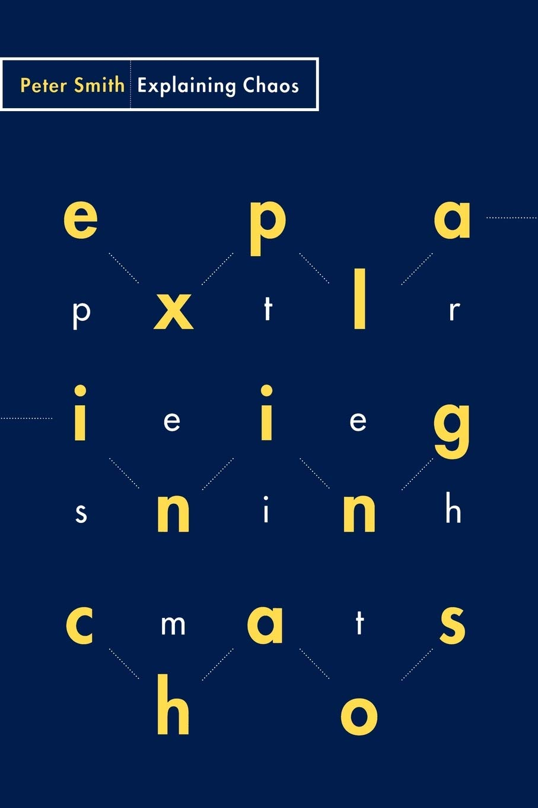
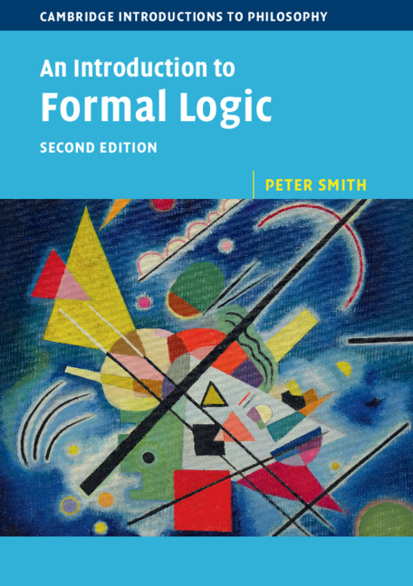
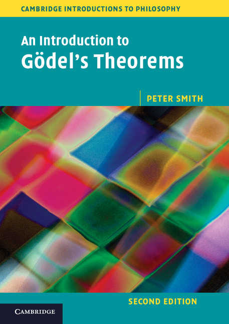

These Logic Matters pages are by me, Peter Smith. Before I retired, I used to teach logic and related things in the University of Cambridge.

And indeed, it was my greatest good fortune to have secure, decently paid, university posts for forty years in leisurely times, with a very great deal of freedom to follow my philosophical and mathematical interests wherever they led. Like many of my generation, I am quite sure I didn't at the time really appreciate just how very lucky I and my contemporaries were. So the more student-orientated areas of this site, such as the Study Guide section, including the freely downloadable [***Beginning Mathematical Logic***](/tyl/), constitute my small but heartfelt effort to give something back by way of thanks. I've also been able to make some previously published books open access.

Before returning to Cambridge in 1998, I was in the Philosophy Department at the University of Sheffield for ten years, and before that was at UCW Aberystwyth (as it then was called, and where there was once a small but rather good department, closed as a result of the 'Thatcher cuts'). In ancient history, I was at [Trinity](http://www.trin.cam.ac.uk/) for eight years, where I took Part II Maths at the end of my second year, and then in my third year got a distinction in [Part III Maths](https://www.maths.cam.ac.uk/postgrad/part-iii/prospective.html) (it has really been downhill all the way since). In my fourth year, I took Part II Moral Sciences for light relief. Then, instead of going back to [DAMTP](http://www.damtp.cam.ac.uk/), I stayed on trying to become a philosopher, for not-very-good reasons, and thereby perhaps rather foolishly missed out on some of the glory days of elementary particle physics.

My amateurish philosophical curiosity used to range pretty widely. I wrote (with my then Aber colleague O.R. Jones) a once quite widely used textbook, [***The Philosophy of Mind: An Introduction***](http://www.cambridge.org/uk/catalogue/catalogue.asp?isbn=9780521312509) (CUP, 1986). Forty years on, it looks very much a product of its time, though its philosophical heart was in the right place andI guess I still believe modified/descendent versions of quite a lot of it! And for twelve years until the end of 1999, I was editor of the philosophy journal [***Analysis***](http://www.oxfordjournals.org/our_journals/analys/about.html), which I enjoyed and which suited my butterfly mind (I could never get the hang of this micro-specializing malarky). It was quite ludicrously time-consuming because I'm so bad at delegating, though I like to think the journal flourished.

I wrote a philosophy of science book [***Explaining Chaos***](https://www.cambridge.org/gb/universitypress/subjects/philosophy/philosophy-science/explaining-chaos?format=PB&isbn=9780521477475) (CUP, 1998), which has some pretty maths, if you like that kind of thing. The book's main point was to deflate some over-excited philosophical views about 'chaos theory'. I would put a few things just a bit differently now; there are one or two minor technical glitches, and I was perhaps unnecessarily pessimistic at the end about the question whether you could 'define' chaos in a way that neatly enough covers the usual paradigms. But the basic deflationary story still seems right to me. By permission of Cambridge University Press, [you can download the whole book here](https://logicmatters.net/resources/pdfs/ExplainingChaos.pdf).

Lately, however, I find myself back where I started in philosophy, most interested in core logic and the foundations of mathematics, and increasingly sceptical about the value of much of the rest. I co-edited [***Vagueness: A Reader***](https://direct.mit.edu/books/edited-volume/5440/VaguenessA-Reader) with Rosanna Keefe (MIT 1997) which collects many of the classic articles with a long introduction — but the more I thought about that, the less I understood (either about vagueness or, more fundamentally, about the rules of the game for giving a theory of vagueness). 

Then, because the world so obviously needed yet another elementary logic book, I wrote up my first-year Cambridge lectures as [***An Introduction to Formal Logic***](/ifl/) (originally published by CUP in 2003). The significantly revised second edition is now available as a free PDF download or an inexpensive Amazon reprint. There are answers to the exercises and other related materials linked on <a href="/ifl/">the IFL page</a>. 

I have also written [***An Introduction to Gödel's Theorems***](/igt/) (CUP 2007, second edition 2013). It is somewhat misleadingly also in an 'Introduction to Philosophy' series. But it actually has quite a high ratio of maths to philosophical commentary, though it still aims to be accessible to advanced undergraduates and beginning graduate students. 

Many sections, especially earlier in the book, were substantially rewritten for the second edition. This later version is also now available as a free PDF download or a very  inexpensive Amazon reprint. There are some other related materials also linked on <a href="/igt/">the IGT page</a>.

As is the way with these things, that Gödel book grew and grew, far past the length of the lecture notes it was originally based on. So I have since put together a much shorter version — a kind of introduction to the *Introduction* — encouragingly called [***Gödel Without (Too Many) Tears***](/igt/). Once more this is available as a free PDF download or an inexpensive Amazon paperback: there's also a classier hardback. 

Both Gödel books should be accessible to anyone who knows just a little formal logic, as neither requires very much technical background.

I have various logical/mathematical projects to keep me from getting bored in retirement, which will I suppose make up for all those misspent years when I somehow got diverted into philosophy when it seems that at heart I'm really just another Trinity mathmo.

  In particular, I have got interested in category theory (at least at an introductory level). I wrote up some notes, put them online, and they have been downloaded surprisingly often. So that encouraged me to put the notes into book form. [***Introducing Category Theory***](/categories/) is freely downloadable from the categories page. For forgiveable reasonws, the book has a slightly complicated publication history, but it is now in its third (and I bhope stable) edition. It presupposes rather less prior mathematics and goes more slowly than some other introductory texts, so I hope it might suit some readers. [The categories page](/categories/) also has many links to other free resources for learning category theory.

  I sporadically [blog here](/blog), when the spirit moves. In fact, the Logic Matters blog started in March 2006. I haven't copied across all the posts from earlier years to this new implementation of the Logic Matters site. However, you can find some of the more interesting(?) [older posts archived here](/archive/).

