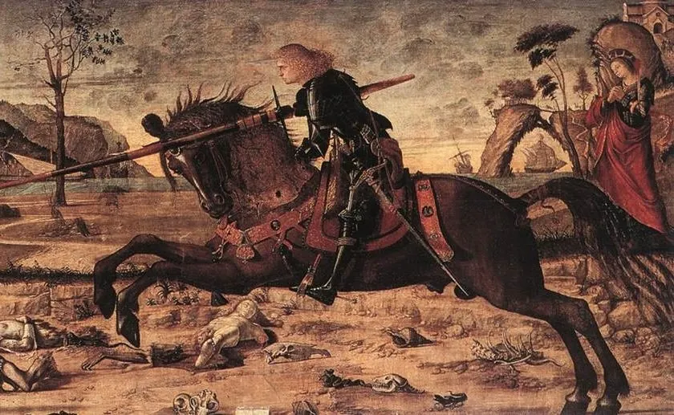

To start with some art books ...

A wonderful memory this. Last time we were in Venice, with the Daughter, we visited the Scuola Dalmata ([Scuola di San Giorgio degli Schiavoni](https://en.wikipedia.org/wiki/Scuola_di_San_Giorgio_degli_Schiavoni)). Though it’s high up the “must see” lists in the guide books, we were the only people there, and had a delightful personal introduction by the custodians (still members of a descendant of the original confraternity). The cycles of paintings in the lower room by Vittore Carpaccio from about 1502 onwards are hugely engaging: here’s St George, and the dragon is about to meet its master ...

Those paintings have so stuck on my mind that I’ve wanted for a while to get better acquainted with Carpaccio’s work. So I bought myself as a birthday present this year [the quite beautifully produced catalogue](https://yalebooks.yale.edu/book/9780300254471/vittore-carpaccio/) for a Carpaccio exhibition a couple of years ago. Wonderful illustrations and interesting and enlightening essays. [Here’s a short video of that same exhibition](https://www.youtube.com/watch?v=1DaA78CdOTA).

But I have also just now discovered that [the Scuola Dalmata also has an online virtual tour](https://www.studiothema.info/vt-videolight/index.html), which gives a really good impression of Carpaccio’s cycle of paintings in their home. Enjoy!  

To be frank, Andrew Graham-Dixon’s *Vermeer: A Life Lost and Found* would have been an even better book if a sterner editor had been at work with the red pen. But as many have said, this is a wonderful book, and deeply illuminating about both the artist's milieu and the paintings. A must read for anyone who cares about Vermeer.

While in Amsterdam we were quite bowled over by the Anselm Kiefer exhibition split between the [Van Gogh Museum](https://www.vangoghmuseum.nl/en/visit/whats-on/exhibitions/anselm-kiefer-sag-mir-wo-die-blumen-sind) and [the Stedelijk Museum](https://www.stedelijk.nl/en/exhibitions/anselm-kiefer-en) next door. Extraordinarily powerful. We had tickets for the last possible entrance time of the day, which still gave us two hours, and this meant that we had the galleries almost to ourselves by the end. I had to restrain myself from getting art books in other museums but, as Mrs Logic Matters agreed, [the beautifully produced book accompanying this exhibition](https://www.vangogh.shop/en/alle-boeken/198246/all-books/722125/anselm-kiefer-where-have-all-the-flowers-gone) is *hugely* worth having.

I have written before about the pleasure of serendipitous finds in charity second-hand bookshops. It isn’t the matter of saving a few pounds (or of giving the money to a charity rather than a chain bookstore); that’s nice, to be sure, but it doesn’t at all account for the pleasure, the happy feeling engendered by the smidgin of good fortune. And it’s the sort of little thing that sticks in the mind -- “Do you remember finding this by chance when we were on holiday in …?” That can become part of your history with a loved book in a way that just marching into Blackwells and picking a copy off the pile never does.

When just back from Amsterdam and visits to the Van Gogh Museum, there in our favourite Oxfam bookshop (in Saffron Walden, surely one of the best run in the land) was a ridiculously cheap copy of the beautifully produced, very large format, *Vincent: by himself*. This intersperses many (quite excellent)  reproductions of paintings and drawings, familiar and unfamiliar, with excerpts from Vincent’s letters to Theo.

We have an ancient paperback of the letters, which I’ve not looked at for decades, so it has been good to be prompted to re-read some. Here’s Vincent after his first visit to the Rijksmuseum, then newly opened in 1885:

> 
‘The Syndics’ is perfect, is the most beautiful Rembrandt; but ‘The Jewish Bride’— not ranked so high, what an intimate, what an infinitely sympathetic picture it is, painted *d'une main de feu*. You see, in ‘The Syndics’ Rembrandt is true to nature, though even there, and always, he soars aloft, to the very highest height, the infinite. But Rembrandt could do more than that - if he did not have to be literally true, as in a portrait, when he was free to idealize, to be poet, that means Creator. That’s what he is in ‘The Jewish Bride’.

Yes, yes, how wonderful ‘The Jewish Bride’ is! 

When we got *Vincent* home, we realized that -- though there were no signs of damp damage -- the book smelt unpleasantly musty when opened. Drat. Yet even this has had a rather good outcome. We have been leaving the book open on a table in the living room by an open window, turning to a new spread every couple of days, and the smell has quickly almost entirely gone -- and this way we have got to spend much more time again than we might otherwise have done with some of Van Gogh’s pictures, as we paused at the table, passing by at random moments. Maybe we should do this with some other art books ...

The final paintings reproduced in *Vincent* show Van Gogh at his most free to idealize, to be poet, concluding with the extraordinary *[Wheatfield with Crows](https://www.vangoghmuseum.nl/en/collection/s0149v1962)*, painted indeed  *d'une main de feu*. It is easy, too easy, to see intimations of his imminent suicide -- the path seeming coming to an untimely stop, the minatory crows. And yes, van Gogh wrote to Theo and his wife, “I have painted three more large canvases. They are vast stretches of wheat under troubled skies, and I didn’t have to put myself out very much in order to try and express sadness and extreme loneliness.” Yet he continues “I hope you’ll be seeing them shortly ... I’m fairly sure these canvases will tell you what I cannot say in words, that is, how healthy and invigorating I find the countryside.”

 

There is a field with crows too in Deryn Rees-Jones’s wrenching sequence of poems in memoriam for her husband. 

 
> 
At the foot of the Sugarloaf
blackthorn spikes and brides
the hedgerows, crows gather
in the upward fields. Now grief
is written in their dark alignments,
sorrow in a nearby field of horses. 

“Now grief is written in their dark alignments” -- just so apt for Van Gogh’s crows too.

Those lines are from Rees-Jones’s admired collection *Erato* which I have been reading and re-reading recently. “Named after the Greek muse of lyric poetry, *Erato* combines documentary-style prose narratives with the passionate lyric poetry for which Rees-Jones is renowned. ... *Erato’*s themes are manifold but particularly focus on personal loss, desire and recovery, in the context of a world in which wars and displacement of people has become a terrifying norm.”

Deryn Rees-Jones is a poet new to me (but another in that long succession of outstanding Anglo-Welsh poets from Edward Thomas through to the wonderful Gillian Clarke and onwards). And I can’t find the right word for that very particular experience of finding a new poetic voice that seems to speak directly to me, engaging the heart. An experience to be much valued.  

And look, here just now is another chance bookshop find! -- a second-hand copy of Deryn Rees-Jones’s earlier volume of selected poems, *What It’s Like to Be Alive.* I’ll relish slowly reading this.

Once upon a very long time ago, in a Cambridge summer garden in quite another life, I read perhaps half of Proust’s *A la recherche du temps perdu*. And then for years, the paperbacks of Scott Moncrieff's translation -- all twelve of them (do you remember their look?) -- followed me around gathering dust. At some point I must have replaced them with Kilmartin’s revised translation which I still have, out of reach on a high shelf, the last of the three volumes still looking suspiciously unread.

A couple of years ago, I noticed that there was a new English version of part of Swann’s Way as *Swann in Love*, translated by Brian Nelson. In a second other life, Brian was a colleague in Aberystwyth. So I picked up a copy and read it -- rather stunned to find how much I remembered both of incident and of atmosphere. But ... But these are not people I can get to care about, or want to know more of. And in the end, the anatomizing of Swann’s obsession, the dissection of the Verdurin circle, left me sometimes amused but more often irritated, and mostly even less engaged than before. Ah well.

But -- more serendipity -- I lately came across Clive James’s “verse commentary” on Proust, fifteen blank verse poems each just three or four pages long. And, though they are uneven, these I have read and read again with considerable pleasure. Do they give me enough of a glimpse of what I am missing to tempt me back to tackle Proust again?  Perhaps not. But here at the end is Clive James, himself writing when not long for this world, speaking of the dying Marcel:

> 
 ... He lay
As powerless as the child that he had been
When waiting an eternity for his mother
To climb the stairs and kiss him. Now my turn
Has come to quit the stage, I only hope
I’ve used my time between strength and departure,
The extra time, a tenth as well as he.
Ah, soldier: what you did. It’s in those shelves
Of books by and about you I will leave
Here in my kitchen which has no cork walls,
Only the English early summer light
That pours in from the garden where my wife
And I meet on my balcony to count
The birds and wonder how to make them stay.
We’ve overdone the food, I think. Next spring,
If I’m still here to help, we might dial down
The chow supply. It’s like Maxim’s out there.
It’s too much. Proust is sometimes that as well,
But not so often as he is austere,
Saying enough to make you see the rest,
As the face of Oriane is not described
But only conjured from your memories
Of everything that you have loved. And soon
All that I love will leave me, as I go
First into silence, then the fire, and then
The harbour water, in which there will be
At last no room to breathe, no time to think:
No time to think even of you, Marcel.

I hope Clive got his wish, and his ashes were indeed scattered under Sydney Harbour bridge ...

I am a great admirer of A.E. Stallings poetry -- the way her enticing surface formal play with rhyme and metre is married to depth and insight, the way she often gives new life to ancient voices (Persephone, Daphne, Penelope, ...) yet her poems “come out of life’s dailiness”. Her *This Afterlife: Selected Poems* (2022) is full of subtle inventiveness, and -- as a reviewer put it -- she “demonstrates that in the right poet’s hands, the putative everydayness of the *hic et nunc* can be transformed into something every bit as rich and strange as even the most ancient myths.”  

But you very probably know that! However I only recently noted that Stallings’ had a new book out in April. Her *Frieze Frame* is on the rich and strange history of the Parthenon Marbles, and how “poets, painters, and their friends framed the debates around Elgin” and his acquisition (or should that be ‘looting’?) of the Marbles. I have just finished this too, and warmly recommend it.

The book began as a short lockdown essay, and has grown to become a quite fascinating scrapbook full of picaresque detail -- ridiculous, infuriating, distressing, touching in turn. And as you’d expect, the writing can be wonderful. How about this, on the actress Melina Mercouri who became Greek Minster of Culture, and a passionate advocate for the return of the Marbles: “The Greeks loved her for this campaign and activism, quite apart from her acting; the Acropolis Metro Station is decorated with a famous photograph of her holding a summer bouquet, standing below the Parthenon on the Acropolis, so that she seems of a piece with one of the sturdy corner columns. In her fawn-colored trench coat, the same pale tawny color as the Pentelic marbles, with her weathered statuesque beauty, she could be a Caryatid on holiday, letting the wind run through her faded blonde hair and clutching the fresh flowers of the eternally recurring Greek spring.” Even if you know the basic story, this is just a terrific read. 

I have for the sixth or seventh time been (re)reading the greatest novel of them all. It’s a banal thing to say, though none the less strikingly true -- the *Anna Karenina* you read at twenty is not the book you encounter again at thirty, or forty, or again later. This time, I had to stop for a few weeks, as I was finding it almost unbearably sad, much more so than I remembered. Too much so for bedtime reading. But stunning of course. 

The reason for mentioning this is to enthusiastically recommend the wonderful translation by Rosamund Bartlett -- which I hugely prefer to Pevear/Volokhonsky, though I still warm to the old Penguin translation by Rosemary Edmonds (here’s a [brief piece by Bartlett](https://www.theguardian.com/books/2014/sep/05/anna-karenina-tolstoy-translation) on the difficulties of translating Tolstoy).

Already, as December approaches, those books-of-the-year pages have started appearing. No less than sixty-six contributors to the *Times Literary Supplement* offer their recommendations in the last issue. Choices of highly variable degrees of attractiveness! A couple of novels have gone on my list of possible titles to browse next time I’m in Heffers. But almost nothing makes we want to rush to the bookshop -- except that A.E. Stallings begins “Karen Solie has (quietly) long been one of the best poets writing in English” and continues with warm praise for Solie’s “tremendous” new book *Wellwater*: I’ll certainly be seeking that out.

The book which happens to be recommended by the TLS team most often is *The Poems of Seamus Heaney*. But am I alone in finding *massive* volumes of poetry -- in this case, over a thousand pages -- often dauntingly off-putting? I got a weighty collected volume of Louise Glück’s poetry some years ago and yet, even so, I later bought some of her individual slim books which are so much more appealing to pick up and read. I think I’d similarly much rather look out for a few more of Heaney’s individually published slim collections to add to the ones we already have.

Those sixty-six contributors must mention almost a hundred and fifty recent books. I’ve read -- or more accurately, read in part -- just three. I’m obviously way off the pace here! I confess I didn’t get very far with Elif Shafak’s *There are Rivers in the Sky* (much as though I had enjoyed a couple of her earlier novels). And more forgivably, I have only read parts of Stefan Collini’s *Literature and Learning* -- the history of English studies in Britain is not particularly my topic, but I always admire Collini’s writing, and the theme of the rise and fall of a certain conception of the critical enterprise interests me. But I’ll most certainly finish the third recommended book which I have been slowly reading, two or three poems at a time. [Sarah Howe’s wonderful *Foretokens*](https://www.sarahhowepoetry.co.uk/Books.html), the follow-up (after ten years) to her prize-winning first collection *Loop of Jade* is again quite exceptional.

So what else would I have recommended as my books of the year? Perhaps Andrew Graham-Dixon’s *Vermeer: A Life Lost and Found* became available too late for our *TLS *contributors to judge; but I’d again put that on my list.

And as for novels? The most recently published ones that I’ve read over the last months seem to have been the most disappointing (how on earth did Andrew Miller’s pedestrian yet prize-winning, Booker-shortlisted, *The Land in Winter* garner such praise?). No, my fiction read of the year -- Tolstoy aside! -- has to be Rosamond Lehmann’s 1936 [*The Weather in the Streets*](https://en.wikipedia.org/wiki/The_Weather_in_the_Streets). For a start, the sheer pleasure to be had from the literary character of her writing beats anything you get from the likes of Andrew Miller by a country mile.
