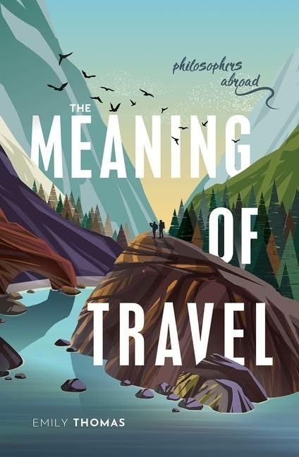

*I wrote this a year ago: who would have guessed that twelve months on, the prospect of travel would still seem almost as remote as it did then ... *

In mid December, the Uffizi can be almost empty of visitors. One year, we were sitting very quietly for some time in what was then the room with the great Botticelli paintings. A few other visitors came and went. But then there was a sudden flurry of noise; and from one corner of the room entered a group of young Chinese, each with their headset, with a guide talking into a microphone. The group processed *without pausing* to the opposite corner and left as quickly as they had arrived. The scene was saddening and comical -- what *was* the point? But then the thought strikes: are our Florentine visits in recent years really *much* better? They are still fleeting, a week at most; our knowledge and understanding of what we are seeing is still shallow; yes, we know a bit of art history, and know a few of the restaurants and cafés the locals like; but we are skimming along the surface. What *is* the meaning of our travel here? (Or is it mere tourism?)

Emily Thomas’s new book *The Meaning of Travel* perhaps didn't full answer my question. But it is a real delight. It is relatively short, and very nicely produced by OUP -- in a small format too, so it will appropriately fit in a jacket pocket on your travels, if only as you stride across the common to your favourite coffee bar to read it. But perhaps that too can be like travel in a miniature way? In my case, the coffee bar  at the end of my walk [sadly gone by 2026] is run by Italians, the chatter is in Italian, the radio is Italian, the coffee and *dolci* are Italian, most of the other customers are non-English. Part of the pleasure, then, is relishing the slight *otherness* (albeit very safe and tame!). And as Emily Thomas suggests, “the difference between everyday journeys and travel journeys lies in how much otherness the traveller experiences”. The businessman who hops on a plane, spends two days cloistered in meetings held in English, stays with colleagues in a familiar international hotel chain, and is pampered again in business class as he flies home hasn't really *travelled*, we feel.

The book is written with a light touch. There are a dozen engaging essays; on maps, for example; on how traveller's tales challenged thoughts about innate ideas; on why mountains changed from forsaken places full of dangers to be avoided (Donne’s “warts and pock-holes on the face of th’earth”) to become places of spendour where you could encounter the sublime; on the idea of wilderness and our relation to nature (or Nature). Some of the usual philosophical suspects appear in familiar stories (Bacon, experimenting to the last, stuffs a chicken with snow, and catches a fatal chill; Descartes, never really settling in one place, travels to wintry Stockholm and dies of flu or perhaps pneumonia). But there are many less familiar philosophers here, on real or imagined journeys (I was intrigued by Margaret Cavendish's bizarre-sounding *Description of a New World, Called the Blazing-World*). And sprinkled through the book are snippets from the author’s obviously lovingly assembled scrapbook of quotations and illustrations (travel adverts and posters for example), and some notes on her own travels. It all makes for a fun and thought-provoking read.

In the last section, “Returning Home: Top 10 Vintage Tips”, there's a quotation from Descartes, in which he remarks of his reading that “conversing with those of past centuries is much the same as travelling”. That's a thought which could have made for another intriguing  essay on the relation between our travelling from place to place and our ‘travelling’ (as best we can) from time to time. And indeed are these not often bound together? When we (at least, the “we” who are likely to be this book’s readers!) go to Venice, it isn’t exactly Venice *now* that we want to see, but a Venice before mass tourism, before tacky gift shops and the like -- so we explore down side canals, getting quite away from the modern clamour (which indeed is still surprisingly easy to do), or escape the crowds by wandering through the city late in the evening. An essay on this theme, the attractions of travelling to sites steeped in history to try to capture that sense of times past,  would have been good to have too.

Early on in the book, Emily Thomas distinguishes *travelling* not only from making a humdrum journey perhaps for work or study abroad (or a less humdrum journey as a refugee, perhaps) but also from going on a pilgrimage. Which got me wondering whether here too is a theme for another essay. For isn't travelling, say, to Florence (braving Ryanair, and -- if you can't go in December! -- braving crowds and unpleasant heat too) a pilgrimage of sorts for some of us? We are visiting Santa Maria Novella, Sant Marco, Santa Croce, ..., because they are still numinous places, the frescoes and paintings still expressive of feelings which have a deeper pull and give us pause. Or, when he writes of it long after, when the world he travelled through on foot has vanished doesn't Patrick Leigh Fermor's walk from the Hook of Holland to Hungary and beyond take on in the telling something of the character of a pilgrimage through Old Europe? I'm not sure: I would have liked to have heard still more, perhaps, about the varieties of travellings and their different meanings.

A writer Emily Thomas could perhaps have engaged with to add some further depth and  nuance is Jonathan Raban (who oddly gets only the most fleeting mention for a comment about Byron). For Raban was not only one of the very best of all English prose writers in the last couple of decades of the last century, but the most reflective -- philosophical, if you will -- of travellers and travel writers. His late, great, *Passage to Juneau* (1999) should have appealed to the author of *The Meaning of Travel*, not only given some Raban's themes (the discovery of otherness and of oneself in the process), but also given its location: some of Emily Thomas's own book is structured loosely round her journeys through Alaska. But I'm thinking too of Raban's earlier masterpiece, *Old Glory* from 1981, notionally recounting his travelling down the Mississippi in a small boat. I say “notionally” as this complex work is lightly disguised as a straight travel book, a literal recounting of a journey taken. But, as I've written here before, the one-time English literature lecturer warns us clearly enough. One of the epigraphs of the book is from T. S. Eliot (writing indeed of the  Mississippi), starting “I do not know much about gods; but I think that the river/Is a strong brown god ...” The other epigraph is from Jean François Millet: “One man may paint a picture from a careful drawing made on the spot, and another may paint the same scene from memory, from a brief but strong impression; and the last may succeed better in giving the character, the physiognomy of the place, though all the details may be inexact.” So we are set up for this to be a mythic tale, and for the “Jonathan Raban” who features as the narrator and in his adventures to be a very inexact rendition of the author and his own journey. And a mythic tale is what we get, as a reviewer noted, a romance-quest -- another kind of journey! -- with ordeal by water, with auguries and signs, battles fought, a princess won (but also lost, for this is a flawed epic, and the journey ends in emptiness). Woven together with this are encounters with American myths of frontiers and journeys.

Raban’s is a many-layered book, particularly artful in the artlessness of its transparent prose. We are reminded that the lesser tales we tell ourselves about our own smaller travellings (at the time and after), while a lot less artful, are no doubt also shot through with their elements of fiction, as we weave our stories to fit some patterns we are perhaps only half-aware of. Which takes us back to *The Meaning of Travel*, which indeed has interesting things to say about the blurred lines between purely fictional travel narratives at one end of the spectrum and (say) some of Darwin's writings at the other. It is such varied narratives which give our travels their varied meanings for us. Emily Thomas in her so-readable book helps us think about some of those narratives. I enjoyed it greatly. Treat yourself!
