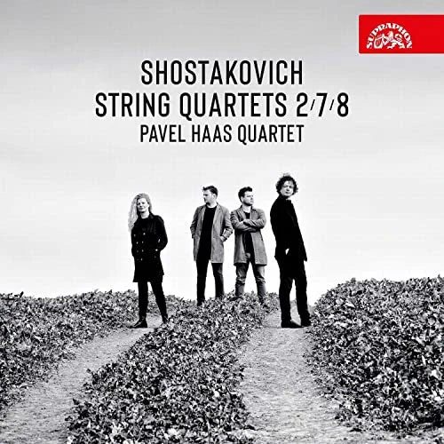

In the most recent issue of the BBC Music Magazine, the "Building a Library" feature is devoted to Shostakovich's much played, much recorded, 8th String Quartet. 

And the chosen top recommended recording is -- not surprisingly -- the astonishing performance by the Pavel Haas Quartet. "There's a total commitment to Shostakovich's vision, with every interpretative decision somehow thoroughly considered yet entirely spontaneous in the moment. Above all, the Pavel Haas Quartet present this quartet not as a chilling
suicide note or an abstract web of ciphers but as a deeply human portrait of an artist."

I hadn't listened to this recording for perhaps a couple of years, but I was absolutely transfixed, hearing it again. Utterly extraordinary music, stupendously well played. Unmissable.