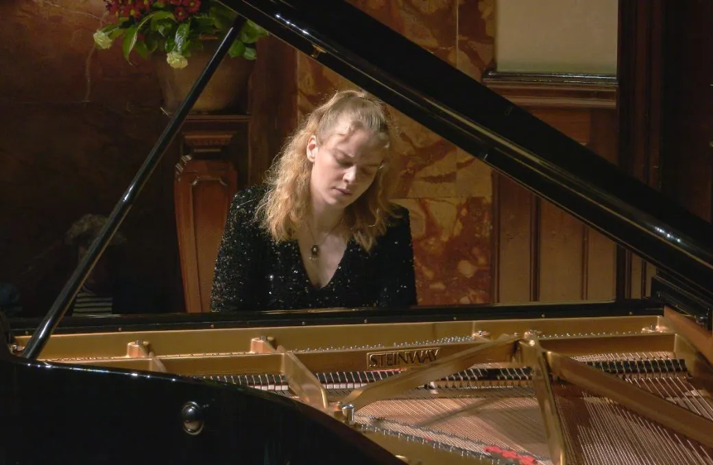

Not the greatest month, so it wasn't possible to get to London to attend Elisabeth Brauß's lunchtime concert in the Wigmore Hall Autumn International Piano Festival at Wigmore Hall on Monday. But it was broadcast live on BBC Sounds, and you can [download it for a month](https://www.bbc.co.uk/sounds/play/m0031pyj).

Elisabeth started with her beloved Mozart, this time the Piano Sonata in F, K332. Next nos II to VI of Bartók's 14 Bagatelles Op. 6, and then XV Le baiser de l’Enfant-Jésus from Messaien's Vingt regards sur l’Enfant-Jésus (all new to me, and I was much taken). There followed Chopin's 
Fantasy in F minor Op. 49.

At the end of the live broadcast at 57.39, I was then completely poleaxed by her encore ... if I'd been in the hall would I have held it together ...?