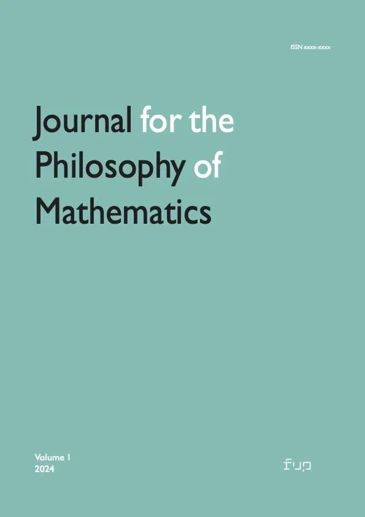

The first issue of the new <em>Journal for the Philosophy of Mathematics</em> appeared back in September 2024. <a href="https://riviste.fupress.net/index.php/jpm">A second issue, now edited by Alex Paseau, has now appeared</a>, just a day before the end of 2025. This is a collection of just seven, again mostly invited, pieces. And despite the officially quite wide-ranging remit of the journal, five of the seven papers are about sets and pluralities.

However, on a quick browse, the papers -- particularly those on set theory -- do look to be very promising and seriously interesting. So do check out the freely downloadable, open-access, issue. I am sternly telling myself that I must finish my proof-reading marathon (and tidy the few sections of the category theory notes that now seem particularly below par) before I let myself properly read, and perhaps comment, on these papers. But I look forward to eventually doing that. And I do hope the <em>Journal</em> is now properly under way, and beginning to receive enough unsolicited pieces of similar quality.

(A minor thing, no doubt, but the way the <em>Journal</em> is produced for online reading strikes me as very elegantly done: all praise to the designer.)

One of the most moving musical videos I’ve come across in the last two or three years is of an extraordinary<a href="https://www.logicmatters.net/2024/01/14/schubert-on-sunday-8-julian-pregardien-and-els-biesemans-die-schone-mullerin/"> <em>Die Schöne Müllerin</em></a>, deeply felt and beautifully sung by Julian Prégardien, accompanied by Els Biesemans (who it seems can hardly hold back tears at the end) on a plangent fortepiano. Here -- and decidedly more cheeringly! -- is Els Biesemans playing a version of Mozart’s Piano Concerto K466 as you’ve never heard it before, again on a fortepiano, with just five string players. Delightful.


