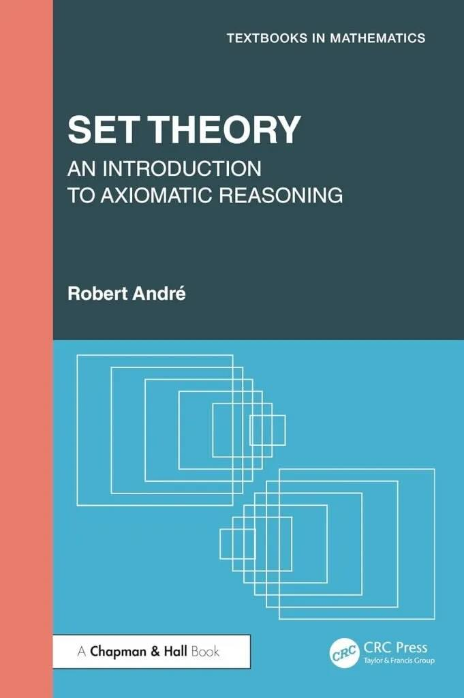
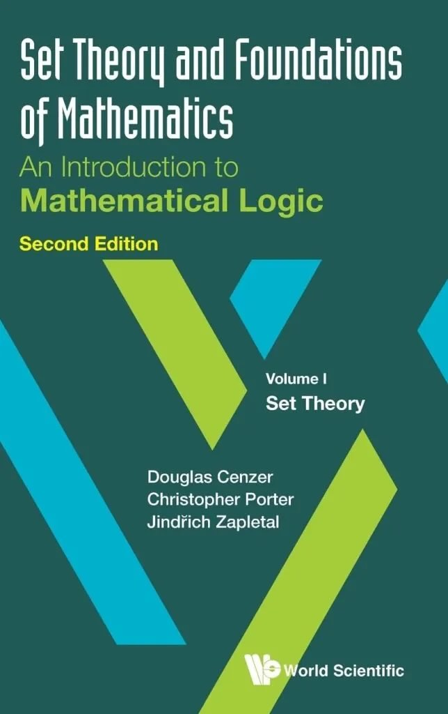
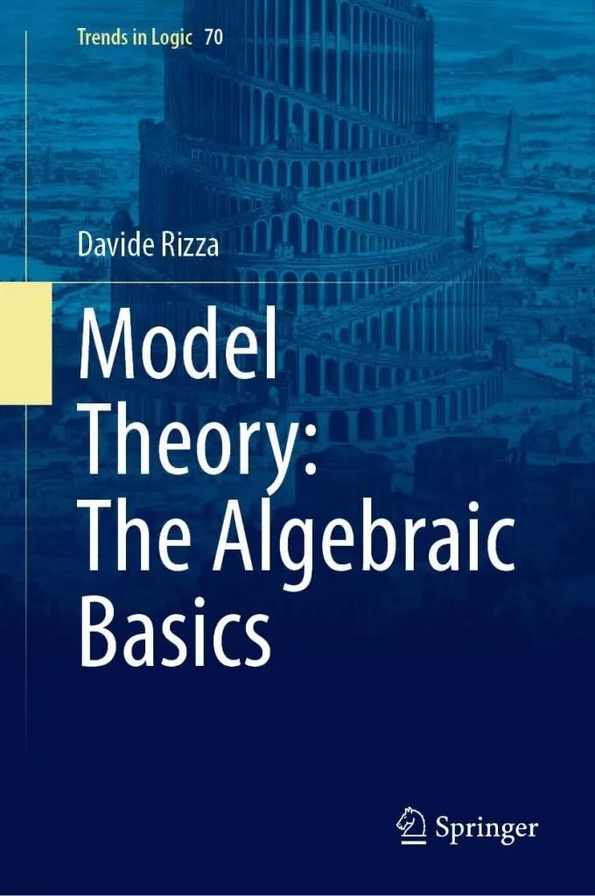

With my mind partly on revising the Study Guide, I have been browsing through three relatively recently published logic books. None of them impress as candidates for self-study. I will be brief (unfairly? life is short ...).

Robert André's <em>Set Theory: An Introduction to Axiomatic Reasoning</em> was published at an outrageous price by CRC Press in 2025. The world is not short of attractively written, reader-friendly, introductions to set theory. But this effort seems clumsily written, and decidedly tedious. A pointless addition that we can ignore.

Also on set theory, we have a revised edition of <em>Set Theory And Foundations Of Mathematics: An Introduction to Mathematical Logic. Volume I: Set Theory</em> by Douglas Cenzer, Chris Porter and Jindra Zapletal (World Scientific, 2025). This short book (some 180 pages) is a pretty brusque review of some basics of set theory in fairly compressed style. It could perhaps make for useful material to consolidate understanding, but surely it is not for most beginners.

The third book is Davide Rizza’s <em>Model Theory: The Algebraic Basics</em> (Springer, 2025). It aims to be particularly accessible. “This book offers a gentle introduction to model theory that stresses basic applications to algebra. Although the book might be used by any mathematically minded reader as a first point of contact with this area of mathematical logic, its main motivation is to provide philosophers with an entry point into model theory.” But I find it very difficult indeed to believe that a philosopher without some significant background in modern algebra is going to cope, what with Noetherian rings by p. 73, and all that. And the book is uninvitingly written -- Rizza isn’t a mathematician and it shows. If I can’t happily push through a chapter with ready understanding and enjoyment, then certainly the intended reader will struggle.

Yes, writing is, or should be, hard work, so that reading isn’t. I have been two days on a couple of Gödelian paragraphs, trying to get the balance and rhythm of some easy exposition right, with words and word order, the relations between the sentences, what precedes them and what is to come, all needing to be shaped into careful patterns, 

<blockquote class="wp-block-quote">

And time yet for a hundred indecisions,  And for a hundred visions and revisions  Before the taking of a toast and tea.

</blockquote>

(to quote Eliot). There is little sign of real writerly care, of vision and revisions, in those three books: the reader gets dry rusks rather than toast and tea.

