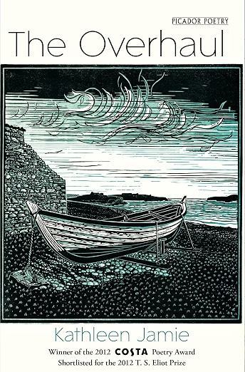

I try not to spend too much time reading substacks (though there is much good, if depressing, writing to be found). But I always enjoy the weekly ['Cultural Capital'](https://jmarriott.substack.com) posts by the *Times* columnist James Marriott. So I just had to buy his new book, *The New Dark Ages: The End of Reading and the Dawn of a Post-Literate Society* (Bodley Head). It isn't long -- I devoured it almost in a single sitting -- and it isn't exactly cheering. Though indeed, I might well be even more pessimistic than Marriott about the way that 'people everywhere are losing the ability to read deeply or think rationally'. But for all that, it is an enjoyable read (in the way that having your prejudices confirmed can be!), and it is written with verve and wit, and with a lot of intriguing background knowledge lightly worn. Warmly recommended.

A recent substack by the author [Devon Halliday](https://devonhalliday.substack.com/p/literary-fiction-has-lost-the-plot) amusingly lambasted some bad writing in a couple of forthcoming efforts at 'literary fiction'. I agree -- self-consciously literary fiction can be dismal. So what fiction *have* I most enjoyed recently? 

By some distance, Lettice Cooper's 1953 novel *Fenny* (Penguin). Set in Tuscany and Florence between 1933 and 1949, it is the story of Ellen Fenwick, who -- bored with a teaching job in England -- takes a job as a governess in Italy, and it tells of her loves and losses, played out against the backdrop of rising fascism. This is republished in the (fairly new) Penguin 'Mermaids' series of books by women authors first published in the 1930s, 40s and 50s. Some other titles in the series look pretty attractive too, but I thought *Fenny* hugely readable and beautifully written. Again warmly recommended.

My poetry reading is sporadic and random. And I confess that I have only recently encountered Kathleen Jamie (who was Scotland's national poet for a while). But over the last couple of weeks I have come to very much admire and enjoy her *The Overhaul* (Picador). This won the 2012 Costa Poetry Award and was shortlisted for the 2012 T.S. Eliot prize. 

Here, from that collection, is [Ospreys](https://www.scottishpoetrylibrary.org.uk/poem/ospreys/). This is surely immediately appealing. But then on a second or third reading, we see the poetic artifice: the long initial sentence reflecting the birds' long flight, the half toppled away line 'half toppled away', the multiplicity of 'beating' (wing beats? fighting? overcoming?). And so it goes. This so rewards close reading, as do many poems in the whole book. 