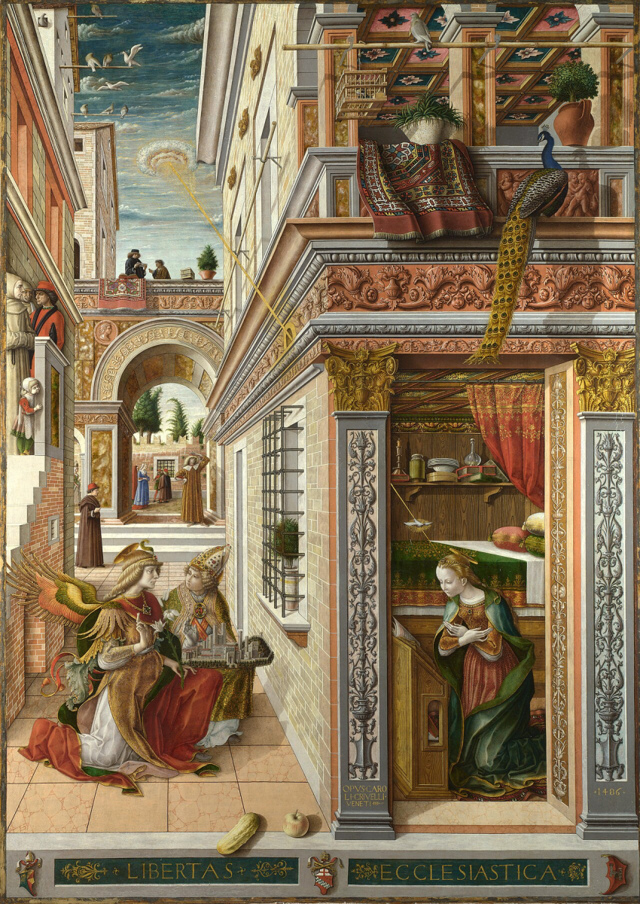

Some of my very favourite paintings are Annunciations ... the stunning Leonardo and Botticelli in the Uffizi, the lovely small painting from a predella by Domenico Veneziano close to home in the Fitzwilliam, the wonderful Filippo Lippi in the National Gallery.   But here instead is the rather strange but still very striking <em>Annunciation, with Saint Emidius</em>&nbsp;by Carlo Crivelli, also in the National Gallery. 

::: {.hanging}
*Rowsety Moid comments:* Carlo Crivelli’s Annunciation is one of my favourite paintings. There are many intriguing details, and the architecture reminds me of Escher.

I like in general the way saints are often depicted together with something that represents an important element of their story, here with Saint Emidius holding a model of what’s presumably the town of Ascoli Piceno. Mary naturally has a book. In the National Gallery of Scotland, there’s a painting that includes Saint Catherine holding and pointing to a small wheel.

[Vitale da Bologna (Vitale dAimo de Cavalli) The Adoration of the Magi](https://www.nationalgalleries.org/art-and-artists/5544)