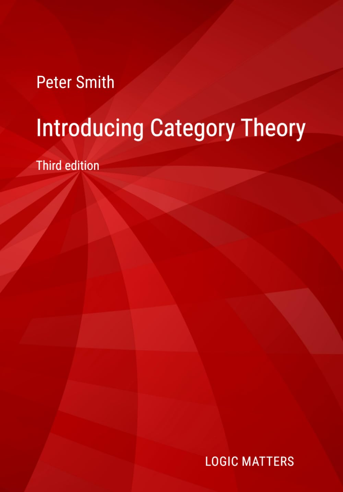
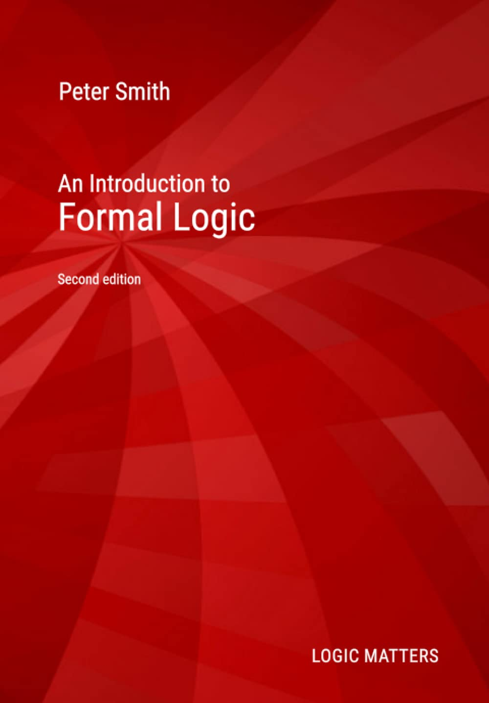
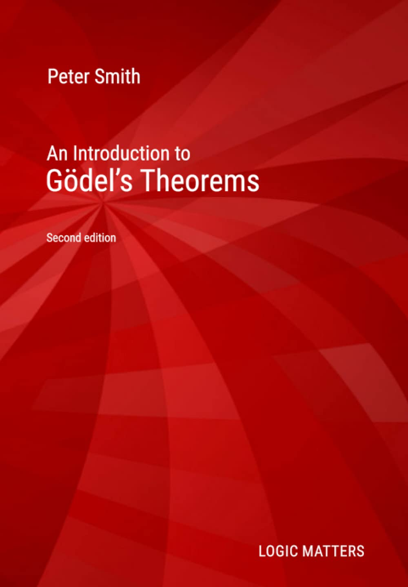
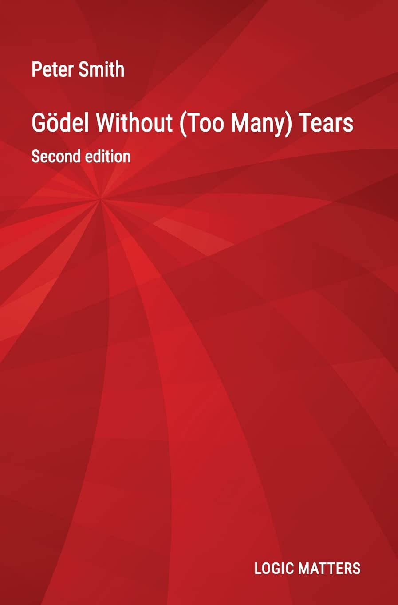
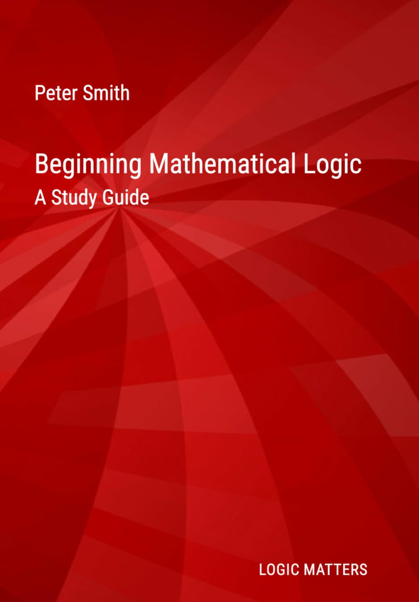

I previously published two logic books with CUP. But I recovered the copyright early in the pandemic, and as a small gesture to students in those very hard times I re-published them as open-access PDFs, entirely free to download. They are also now available as minimum cost paperbacks using the Amazon print-on-demand system (because this produces acceptable-quality books very inexpensively).

Before I retired from the University of Cambridge, it was my greatest good fortune to have secure, decently paid, university posts for forty years in leisurely times, with almost total freedom to follow my philosophical and mathematical interests wherever they meandered. Like most of my contemporaries, for much of that time I didn’t really appreciate how extraordinarily lucky I was. To give a little back by way of heartfelt thanks, I have also put together three further student-oriented books, which are again free to download. Beginning Mathematical Logic is developed from the earlier much-used Teach Yourself Logic study guide.

So, in a bit more detail, here they all are!

## Introducing Category Theory

Introducing Category Theory is the third expanded edition (2026) of a set of much-downloaded notes.

Part I introduces elementary categorial treatments of ideas like products, quotients, exponentials, etc. Part II gets down to the serious business of core topics like the Yoneda Lemma and adjunctions. Part III briefly explores the idea of an elementary topos. 

This book will provide very accessible preliminary or parallel reading for those starting a course on category theory, but should also be of interest to anyone who wants to get some sense of what the categorial fuss is about, as the book presupposes relatively little mathematical background. It is [freely downloadable](/categories) and is available as an inexpensive paperback.

## An Introduction to Formal Logic

An Introduction to Formal Logic, based on the first-year lecture course I gave for many years, was originally published by Cambridge University Press (2003, 2020). A corrected version of the second edition is now available as a freely downloadable PDF.

Many people, however, prefer if possible to work from a physical book. So you can get a print-on-demand copy of IFL as a very inexpensive large-format paperback from Amazon. There is also a nice but still inexpensive hardback version intended for libraries. 

To download the book, see [the IFL page](/ifl), where you will also find answers to exercises, and some additional resources.

## An Introduction to Gödel’s Theorems

An Introduction to Gödel’s Theorems was first published in 2007 also by Cambridge University Press, with the second edition appearing in 2013. It was published in a philosophy series, but is full of theorems — so mathematics students should find it useful too.

A corrected version of the second edition is now available as a freely downloadable PDF a print-on-demand version as an inexpensive large format paperback. 

To download the book, see [the IGT page](/igt) where you will find further support documents.

## Gödel Without (Too Many) Tears

Gödel Without (Too Many) Tears is a much shorter book (2020, 2022) based on the lectures I used to give to undergraduate philosophers taking the Mathematical Logic paper. The lectures, however,were still full of theorems rather than philosophical commentary). My notes have been tidied-up into a book format, now in its second edition. You can think of it as a cut-down version of the longer Gödel book, aiming to highlight some of the key technical facts about the incompleteness theorems in an accessible way.

This book is again [available as a PDF from the IGT page](/igt). There is also an extremely inexpensive print-on-demand book available from Amazon, and a hardback too. 

## Beginning Mathematical Logic

If you want to self-study logic, or are looking for supplementary reading before or during a university course, how do you find your way around the very large literature old and new? 

*Beginning Mathematical Logic* provides an extended Study Guide, giving introductory overviews of the core topics and then recommending the best books for studying these topics enjoyably and effectively. 

To download the book, see [the Guide page](/tyl). Once again, there is also a very inexpensive print-on-demand book available from Amazon. 
