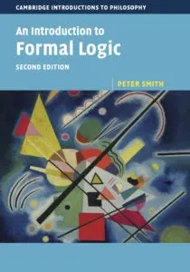

### Quick links

- [The book and how to get it](#book)
- [Corrections](#corrections)
- [Exercises and worked answers](#exercises)
- [On truth trees](#trees)
- [Logic bites and snippets](#podcasts)
- [Other supplementary materials](#supp)
- [Other books](#other)

## The book and how to get it {#book}

*An Introduction to Formal Logic* was originally published by Cambridge University Press (1st edition 2003; 2nd edition 2020). It began life as lecture notes for a course for first-year philosophers which I taught for many years. Initially as a small contribution to students in the tough Covid era, a corrected version of the second edition is now available as [a freely downloadable PDF](pdfs/IFL2_LM.pdf).

Many people, however, prefer to work from a physical book. And you can get a print-on-demand copy of *IFL* as an inexpensive large-format paperback from Amazon: [UK link](https://www.amazon.co.uk/dp/B08GB4BDPG/) or [US link](https://www.amazon.com/dp/B08GB4BDPG/) or find on your local Amazon by using the ASIN identifier B08GB4BDPG in their search field.

There is also a slightly nicer but still inexpensive hardback version intended for libraries, available from bookshops and library suppliers as well as from online sellers, with the ISBN 978-1916906327.

This second edition has been very extensively revised and rewritten, and one major difference from the first edition should be highlighted here. The book now focuses on a *natural deduction* proof system done Fitch-style, while the previous edition introduced so-called *truth trees* (tableaux). However, revised versions of the old chapters on truth trees for propositional and for predicate logic are still available, but now as freely available online supplements here; so those teaching a tree-based course based on the first edition aren’t being cut adrift.

If you want to get an idea of the way the book proceeds without skimming the whole PDF, then the section-by-section table of contents should give you a good indication:

- [Section-by-section table of contents for IFL2](pdfs/IFL2-contents.pdf)

If you want to know about the particular natural deduction system adopted — since no two books seem to use exactly the same ND system — you’ll get a good idea from:

- [Diagrammatic summary of PL natural deduction rules used in IFL2](pdfs/PLrulespage.pdf)
- [Diagrammatic summary of QL natural deduction rules used in IFL2](pdfs/QLrulespage.pdf)

## Corrections! {#corrections}

Inevitably — it is a law of book-writing! — there will be typos (and possibly thinkos too) which need correction. They are listed on the following page:

- [IFL2 corrections page](pdfs/Corrections-for-IFL2.pdf)

There are currently about twenty typos which need correction of which only two or three are likely to cause puzzlement. Printed and PDF versions of the book will be intermittently updated when enough corrections accrue.

## The exercises, and worked answers {#exercises}

There is a (fairly modest) set of exercises at the end of most chapters. There are standalone versions for most of the question sets and (often very detailed) worked answers here:

- [End-of chapter exercises from IFL2, and their solutions](exercises.qmd).

If you are looking for answers to the exercises in the first edition, then [go to this page](/ifl/ifl_1st/).

## On truth trees {#trees}

Ideally beginners should end up knowing about both ND and truth trees (tableaux); different teachers will make different choices of which to do first. If you want to use the book for a tree-based course, or want to find out about trees later, here are some more chapters! (Relevant exercises will follow.)

- [Trees for propositional logic](pdfs/TruthTreesPL1.pdf) — \[Considerably revised from *IFL1*\]
- [Trees for quantificational logic](pdfs/QuantifierTreesCM.pdf) — \[Temporary version soon to be revised\]

## Logic bites and snippets {#podcasts}

In lieu of podcasts introducing chapters or pairs of chapters (it’s too difficult to handle symbols in an audio format!), I wrote a series of bitesized informal written introductions giving some orientation in a reasonably relaxed way to early chapters:

- [Logicbites](logicbites.qmd) — a series of short introductions to early chapters, and some related topics.

Over the years, I have answered a lot of logic-related questions on the exceedingly useful [math.stackexchange](https://math.stackexchange.com) site. Here are some of my efforts -- and many should be accessible to (near) beginners:

- [Logical snippets: over a hundred short answers to queries on elementary logic](logical-snippets.qmd) —

## Other legacy supplementary materials of various kinds {#supp}

- [Sets, relations and functions](pdfs/SetsRelationsFunctions.pdf). In *IFL* we really play down the use of set-theoretic notation. In parallel reading, you may well encounter such notation being put to use. This old handout might help to explain.
- [Proof systems](pdfs/ProofSystems.pdf). It is hinted in *IFL2* that natural deduction can be done in other styles than Fitch’s. For something on this, and on other proof systems, see another legacy handout.
- ['If' and '⊃'](pdfs/Conditionals.pdf) says more about Grice’s theory of conditionals.
- [How to read Dummett on Quantifiers](pdfs/DummettNotes.pdf).
- [Intentional Contexts](pdfs/Intentional.pdf) expands on some themes briefly skirted around in the book.
- [Russell’s Theory of Descriptions](pdfs/Russell.pdf) expands on some themes in the book’s chapter.

## Other books? {#other}

There are many other first introductions to logic at a similar level to *IFL*, some terrible, some mediocre, and a few very good. For a short freely downloadable text, see versions of [*forall X*](pdfs/forallxcam.pdf).

I think the best traditional book alternative is my namesake Nick Smith’s excellent work, but the focus of this page is on the local IFL materials and their supplements.