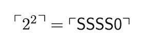

**1. The problem**

It is standard to use corner quotes in denoting Gödel numbers. The simple way of setting corner quotes in LaTeX is as follows:

> `$\ulcorner\phi\urcorner$ is the G\"odel number of $\phi$.`

This usually works just fine, to give

> $\ulcorner\phi\urcorner$ is the Gödel number of $\phi$.

But suppose (to follow another standard convention) that we also use corner quotes round a (metalinguistic) designator for *n* to signify the Gödel number for the standard formal numeral for the number *n*. So ...

> $\ulcorner 2^2 \urcorner = \ulcorner \mathsf{SSSS0} \urcorner$

The setting of the corner quotes on the left of the equation is ugly. We'd like to raise them to the height of the exponent.

And if we need to set a lot of corner-quoted expressions, we'd also like to define a snappier command to cut down keystrokes. So, we'd *like *to be able to type something like below to get a nice result.

> `$\Godelnum{2^2} = \Godelnum{\mathsf{SSSS0}}$`

---

**2. The solution**

Use Sam Buss's nice macro defining `\Godelnum` (change the name to taste!). Simply paste into your document preamble the following:

```
\newbox\gnBoxA
\newdimen\gnCornerHgt
\setbox\gnBoxA=\hbox{$\ulcorner$}
\global\gnCornerHgt=\ht\gnBoxA
\newdimen\gnArgHgt
\def\Godelnum #1{%
\setbox\gnBoxA=\hbox{$#1$}%
\gnArgHgt=\ht\gnBoxA%
\ifnum     \gnArgHgt<\gnCornerHgt \gnArgHgt=0pt%
\else \advance \gnArgHgt by -\gnCornerHgt%
\fi \raise\gnArgHgt\hbox{$\ulcorner$} \box\gnBoxA %
\raise\gnArgHgt\hbox{$\urcorner$}}
```
Exactly as we wanted, in math mode,

> `$\Godelnum{...}$`

sets the contents of the brackets between corner quotes, now positioned so their top edges are level with the top of the box containing the contents.

 


When single letters or symbols are to be set in corner quotes, you can of course drop the brackets, thus

> `$\Godelnum A$, $\Godelnum \phi$, ...`

*Updated 3 June 2026*