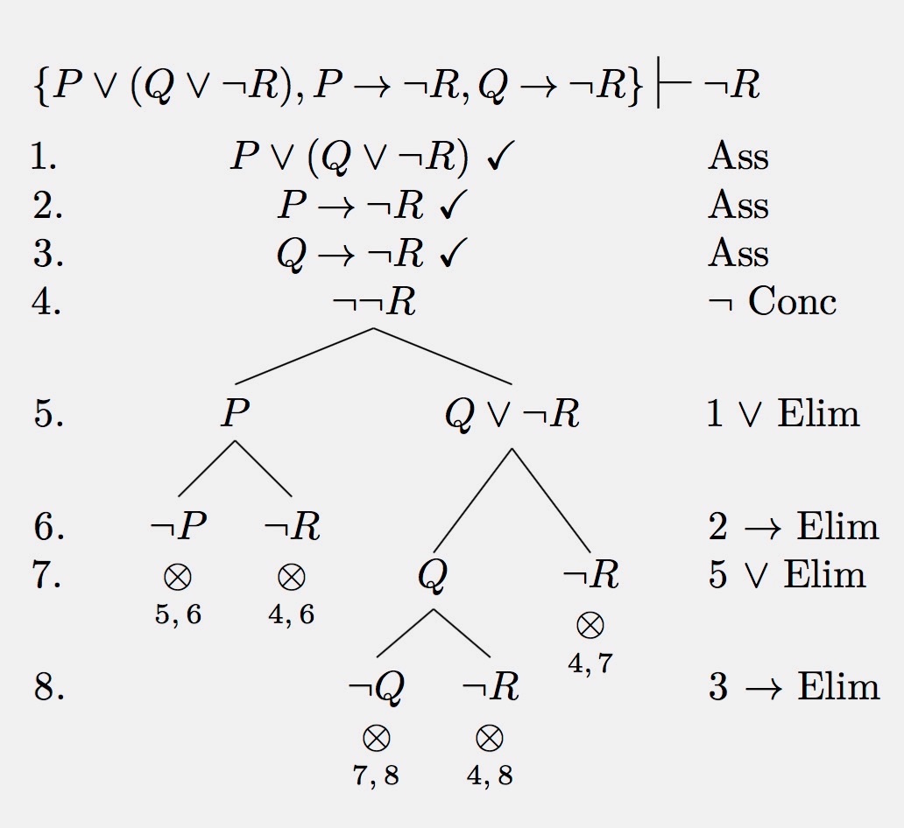

The task is to set proof-trees, i.e. tableaux, of the sort that appear in e.g. Richard Jeffrey's classic *Formal Logic* or in the first edition of my own *Introduction to Formal Logic*.

A very flexible modern package, allowing you also to add line numbers (if you want) and line-by-line justifications is provided by

- [Prooftrees](http://ctan.org/pkg/prooftrees) (Clea Rees). Read the package documentation for many examples of its power and flexibility (also see my older document [Setting Tableaux using Prooftrees](pdfs/L4LProoftrees.pdf)).

Here's an example of its output, taken from the package documentation, and there are simpler examples in my document:

{.img-half}

Because of issues with the complex packages that prooftrees.sty invokes, a document with many trees does become slow to typeset. However you can use the "memoize" package so that (unchanged) diagrams are not re-processed every time you re-typeset your document, considerably speeding things up.

Compatibility note: prooftrees can be used alongside bussproofs — either load bussproofs first, or load prooftrees with the tableaux option. 

Older options for setting tableaux often require bits of trickery to get nice-looking trees (and don't supply the option of line numbers etc.).  I'll mention them, however, in case they may be enough for your purposes. Two options are

- The [qtree.sty](ctan.org/pkg/qtree) package, written for typesetting linguists' syntactic trees, can also be adapted to logicians' purposes.

- [pgf and TikZ](http://sourceforge.net/projects/pgf/) (a general TeX macro package for generating graphics, with a user-friendly syntax layer called TikZ). [tikz-qtree](http://www.ctan.org/tex-archive/graphics/pgf/contrib/tikz-qtree/) provides a macro for drawing trees with TikZ using an easy syntax.

For something about setting trees with these two packages see Alex Kocurek's document [Proofs in LaTeX](http://www.actual.world/resources/tex/doc/Proofs.pdf).

*Last updated 4 June 2026*
