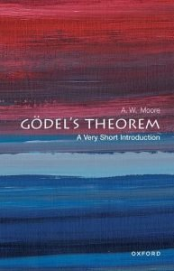

There has just been published another in the often splendid OUP series of “Very Short Introductions”: this time, it’s the Oxford philosopher Adrian Moore, writing on *Gödel’s Theorem*. I thought I should take a look.

This little book is not aimed at the likely readers of this blog. But you could safely place it in the hands of a bright high-school maths student, or a not-very-logically-ept philosophy undergraduate, and they should find it intriguing and probably reasonably accessible, and they won’t be led (too far) astray. Which is a lot more than can be said for some other attempts to present the incompleteness theorems to a general reader.

I do like the way that Moore sets things up at the beginning of the book, explaining in a general way what a version of Gödel’s (first) theorem shows and why it matters — and, equally importantly, fending off some initial misunderstandings.

Then I very much like the way that Moore first gives the proof that he and I both learnt very long since from Timothy Smiley, where you show that (1)  a consistent, negation-complete, effectively axiomatized theory is decidable, and (2) a consistent, sufficiently strong, effectively axiomatized theory is *not* decidable, and conclude (3) a consistent, sufficiently strong, effectively axiomatized theory can’t be complete. Here, being “sufficiently strong” is a matter of the theory’s proving enough arithmetic (being able to evaluate computable functions). Moore also gives the close relation of this proof which, instead of applying to theories which prove enough (a syntactic condition), applies to theories which express enough arithmetical truths (a semantic condition). That’s really nice. I only presented the syntactic version early in *IGT* and *GWT *and (given that I elsewhere stress that proofs of incompleteness come in two flavours, depending on whether we make semantic or proof-theoretic assumptions) maybe I should have explicitly spelt out the semantic version too.

Moore then goes on to outline a proof involving the Gödelian construction of a sentence for PA which “says” it is unprovable in PA, and then generalizes from PA. (Oddly, he starts by remarking that “the main proof in  Gödel’s article … showed that no theory can be sufficiently strong, sound, complete and axiomatizable”, which is misleading as a summary because Gödel in 1931 didn’t have the notion of sufficient strength available, and arguably also misleading about the role of semantics, even granted the link between $\Sigma_1$-soundness and $\omega$-consistency, given the importance that Gödel attached to avoiding dependence on semantic notions. The following text does better than the headline remark.) Moore then explains the second theorem clearly enough.

The last part of the book touches on some more philosophical reflections. Moore briefly discusses Hilbert’s Programme (I’m not sure he has the measure of this) and the Lucas-Penrose argument (perhaps forgivably pretty unclear); and the book finishes with some rather limply Wittgensteinean remarks about how we understand arithmetic despite the lack of a complete axiomatization. But I suppose that if these sections spur the intended reader to get puzzled and interested in the topics, they will have served a good purpose.

My main trouble with the book, however, is with Moore’s presentational style when it comes to the core technicalities. To my mind, he doesn’t really have the gift for mathematical exposition. Yes, all credit for trying to get over the key ideas in a non-scary way. But I, for one, find his somewhat conversational mode of proceeding doesn’t work that well. I do suspect that, for many, something a bit closer to a more conventionally crisp mathematical mode of presentation at the crucial stages, nicely glossed with accompanying explanations, would actually ease the way to greater understanding. Though don’t let that judgement stop you trying the book out on some suitable potential reader, next time you are asked what logicians get up to!
