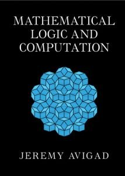

I have at last returned to finish reading Jeremy Avigad’s *Mathematical Logic and Computation*, which was published last year by CUP. Here, now put together into one post, are some thoughts about the book (increasingly less per chapter, as I came to realise that — despite Avigad’s intentions and despite the many virtues of the book — this isn’t really a book for beginners, and so it won’t in the end feature largely in main part of the *Beginning Mathematical Logic* Study Guide).

---

The first seven chapters, some 190 pages, form a book within the book, on core FOL topics but with an unusually and distinctively proof-theoretic flavour. This is well worth having. But a reader who is going to happily navigate and appreciate the treatments of topics here will typically need significantly more background in logic than Avigad implies. The exposition is often *very* brisk, and the amount of motivational chat is variable and sometimes minimal. So — to jump to a first verdict — some parts of this book-within-a-book will indeed be recommended in the *Guide*, but as supplementary reading for those who have already tackled one of the standard FOL texts.

To get down to details. Chapter 1 of *MLC* is on “Fundamentals”, aiming to “develop a foundation for reasoning about syntax”. So we get the usual kinds of definitions of inductively defined sets, structural recursion, definitions of trees, etc. and applications of the abstract machinery to defining the terms and formulas of FOL languages, proving unique parsing, etc., but all done in a quite hard-core way. But as Avigad notes, the reader can skim and skip and return to the details later on a need-to-know basis.

But there is one stand-out decision that is perhaps worth commenting on. Take the two expressions $\forall xFx$ and $\forall yFy.$ The choice of bound variable is of course arbitrary. It seems we have two choices here:
- Just live with the arbitrariness. Allow such expressions as distinct formulas, but prove that  formulas like these which are can be turned into each other by the renaming of bound variables (formulas which are $\alpha$-equivalent, as they say) are always interderivable, are logically equivalent too.
- Say that formulas proper are what we get by quotienting expressions by $\alpha$-equivalence, and lift our first-shot definitions of e.g. wellformedness for expressions of FOL to become definitions of wellformedness for the more abstract formulas proper of FOL.

Now, as Avigad says, there is in the end not much difference between these two options; but he plumps for the second option, and for a reason. The thought is this. If we work at expression level, we will need a story about allowable substitutions of terms for variables that blocks unwanted variable-capture. And it is suggested there are three ways of doing this, none of which is entirely free from trouble according to him.
- Distinguish free from bound occurrences of variables, define what it is for a term to be free for a variable, and only allow a term to be substituted when it is free to be substituted. Trouble: “involves inserting qualifications everywhere and checking that they are maintained.”
- Modify the definition of substitution so that bound variables first get renamed as needed — so that the result of substituting $y + 1$ for $x$ in $\exists y(y > x)$ is something like $\exists z(z > y + 1)$. Trouble: “Even though we can fix a recipe for executing the renaming, the choice is somewhat arbitrary. Moreover, because of the renamings, statements we make about substitutions will generally hold only up to $\alpha$-equivalence, cluttering up our statements.”
- Maintain separate stocks of free and bound variables, so that the problem never arises. Trouble: “Requires us to rename a variable whenever we wish to apply a binder.”

But the supposed trouble counting against the third option is, by my lights, no trouble at all. Why so?

Avigad is arguably quite misdescribing what is going on in that case. Taking the Gentzen line, we distinguish constants with their fixed interpretations, parameters or temporary names whose interpretation can vary, and bound variables which are undetachable parts of a quantifier-former we might represent ‘$\forall x \ldots\ x\ldots \ x\ldots$’. And when we quantify $Fa$ to get $\forall xFx$ we are not “renaming a variable” (a trivial synactic change) but we are — in one go, so to speak replacing the parameter with a variable and prefixing a linked quantifier, and that complex makes a single semantic unit which has a quite different semantic role from a parameter. There’s a good Fregean principle, use different bits of syntax to mark different semantic roles: and that’s what is happening here when we replace the ‘$a$’ by the ‘$x$’ and at the same time bind with the quantifier ‘$\forall x$’.

So its seems to me that option 1c is in fact very markedly more attractive than Avigad has it (it handles issues about substitution nicely, and meshes with the elegant story about semantics which has $\forall xFx$ true on an interpretation when $Fa$ is true however we extend that interpretation to give a referent to the temporary name $a$). The simplicity of 1c compared with option 2 in fact gets the deciding vote for me.

---

After the chapter of preliminaries, *MLC* has two chapters on propositional logic (substantial chapters too, some fifty-five large format pages between them, and they range much more widely than the usual sort of introductions to PL in math logic books).

Avigad’s general approach foregrounds syntax and proof theory. So these two chapters start with §2.1 quickly reviewing the syntax of the language of PL (with $\land, \lor, \to, \bot$ as basic — so negation has to be defined by treating $\neg A$ as $A \to \bot$). §2.2 presents a Hilbert-style axiomatic deductive system for minimal logic, which is augmented to give systems for intuitionist and classical PL. §2.3 says more about the provability relations for the three logics (initially defined in terms of the existence of a derivation in the relevant Hilbert-style system). §2.4 then introduces natural deduction systems for the same three logics, and outlines proofs that we can redefine the same provability relations as before in terms of the availability of natural deductions. §2.5 notes some validities in the three logics and §2.6 is on normal forms in classical logic. §2.7 then considers translations between logics, e.g. the Gödel-Gentzen double-negation translation between intuitionist and classical logic. Finally §2.8  takes a *very* brisk look at other sorts of deductive system, and issues about decision procedures.

As you’d expect, this is all technically just fine. But I strongly suspect an amount of prior knowledge will be pretty essential if you are really going get much out the discussions here. Yes, the point of the exercise isn’t to get the reader to be a whizz at knocking off complex Gentzen-style natural deduction proofs (for example); but are there quite enough worked examples for the genuine newbie to get a good feel for the claimed naturalness of such proofs? Is a single illustration of a Fitch-style alternative helpful? I’m very doubtful.

To continue, Chapter 3 is on semantics. We get the standard two-valued semantics for classical PL, along with soundness and completeness proofs, in §3.1. Then we get interpretations in Boolean algebras in §3.2. Next, §3.3 introduces Kripke semantics for intuitionistic (and minimal) logic — as I said, Avigad is indeed casting his net significantly more widely that usual in introducing PL. §3.4 gives algebraic and topological interpretations for intuitionistic logic. And the chapter ends with a pretty challenging §3.5, ‘Variations’, introducing a generalized Beth semantics. As you can see, a lot is going on here!

Still, I think that for someone coming to *MLC* who already *does* have enough logical background (perhaps a bit half-baked, perhaps rather fragmentary) and who is mathematically adept enough, these chapters — perhaps initially minus their last sections — should bring a range of technical material into a nicely organised story in a very helpful way, giving a good basis for pressing on through the book.

---

The next two chapters of *MLC* are on the syntax and proof systems for FOL — in three flavours again, minimal, intuitionstic, and classical — and then on semantics and a smidgin of model theory. Again, things proceed at considerable pace, and ideas come thick and fast.

So in a bit more detail, how do Chapters 4 and 5 proceed? Broadly following the pattern of the two chapters on PL, in §4.1 we find a brisk presentation of FOL syntax (in the standard form, with no syntactic distinction made between variables-as-bound-by-quantifiers and variables-standing-freely). Officially, recall, wffs that result from relabelling bound variables are identified. But this seems to make little difference: I’m not sure what the gain is, at least here in these chapters, in a first encounter with FOL.

§4.2 presents axiomatic and ND proof systems for the quantifiers, adding to the systems for PL in the standard ways. §4.3 deals with identity/equality and says something about the “equational fragment” of FOL. §4.4 says more than usual about equational and quantifier-free subsystems of FOL, noting some (un)decidability results. §4.5 briefly touches on prenex normal form. §4.6 picks up the topic (dealt with in *much* more detail than usual) of translations between minimal, intuitionist, and classical logic. §4.7 is titled “Definite Descriptions” but isn’t as you might expect about how to add a description operator, a Russellian iota, but rather about how — when we can prove $\forall x\exists! yA(x, y)$ — we can add a function symbol $f$ such that $f(x) = y$ holds when $A(x, y)$, and all goes as we’d hope. Finally, §4.8 treats two topics: first, how to mock up sorted quantifiers in single-sorted FOL; and second, how to augment our logic to deal with partially defined terms. That last subsection is very brisk: if you *are* going to treat any varieties of free logic (and I’m all for that in a book at this level, with this breadth) there’s more worth saying.

Then, turning to semantics, §5.1 is the predictable story about full classical logic with identity,  with soundness and completeness theorems, all crisply done. §5.2 tells us more about equational and quantifier-free logics.  §5.3 extends Kripke semantics to deal with quantified intuitionistic logic. We then get algebraic semantics for classical and intuitionistic logic in §5.4 (so, as before, Avigad is casting his net more widely than usual — though the treatment of the intuitionistic case is indeed pretty compressed). The chapter finishes with a fast-moving 10 pages giving us two sections on model theory. §5.5 deals with some (un)definability results, and talks briefly about non-standard models of true arithmetic. §5.6 gives us the L-S theorems and some results about axiomatizability. So that’s a great deal packed into this chapter. And at a sophisticated level too — it is perhaps rather telling that the note at the end of the chapter gives Peter Johnstone’s hard-core book on *Stone Spaces* as a “good reference” for one of the constructions!

The same judgement applies, I think, as to the chapters on PL: very good material for someone already on top of the basics, and wanting to consolidate and expand their knowledge, but not the place to start.

One minor comment: I note that models for a FOL language are defined in the standard way as having a *set* for quantifiers to range over,  but with a function (of the right arity) over that set as interpretation for each function symbol, and a relation (of the right arity) over that set as interpretation for each relation symbol. My attention might have flickered, but Avigad seems happy to treat functions and relations as they come, not explicitly trading them in for set-theoretic surrogates (sets of ordered tuples). But then it is interesting to ask — if we treat functions and relations as they come, without going in for a set-theoretic story, then why not treat the quantifiers as they come, as running over some objects plural? That way we can interpret e.g. the first-order language of set theory (whose quantifiers run over more than set-many objects) without wriggling. Avigad does in general seem to nicely downplay the unnecessary invocation of sets — though not quite consistently. I’d go for consistently avoiding unnecessary set talk from the off — thus making it much easier for the beginner at serious logic to see when set theory starts doing some real work for us. Three cheers for sets: but in their proper place!

---

*MLC* continues, then, with Chapter 6 on Cut Elimination. And the order of explanation here is, I think, interestingly and attractively novel.

Yes, things begin in a familiar way. §6.1 introduces a standard sequent calculus for (minimal and) intuitionistic FOL logic without identity. §6.2 then, again in the usual way, gives us a sequent calculus for classical logic by adopting Gentzen’s device of allowing more than one wff to the right of the sequent sign. But then Avigad notes that we can trade in *two-sided* sequents, which allow sets of wffs on both sides, for *one-sided* sequents where everything originally on the left gets pushed to the right of sequent side (being negated as it goes). These one-sided sequents (if that’s really the best label for them) are, if I recall, not treated at all in Negri and von Plato’s lovely book on structural proof theory; and they are mentioned as something of an afterthought at the end of the relevant chapter on Gentzen systems in Troelstra and Schwichtenberg. But here in *MLC* they are promoted to centre stage.

So in §6.2 we are introduced to a calculus for classical FOL using such one-sided, disjunctively-read, sequents (we can drop the sequent sign as now redundant) — and it is taken that we are dealing with wffs in ‘negation normal form’, i.e. with conditionals eliminated and negation signs pushed as far as possible inside the scope of other logical operators so that they attach only to atomic wffs. This gives us a very lean calculus. There’s the rule that any $\Gamma, A, \neg A$ with $A$ atomic counts as an axiom. There’s just one rule each for $\land$, $\lor$, $\forall$, $\exists$. There also is a cut rule, which tells us that from $\Gamma, A$ and $\Gamma, {\sim}{A}$ we can infer $\Gamma$ (here ${\sim}{A}$ is notation for the result of putting the negation of $A$ in negation normal form).

And Avigad now proves twice over that this cut rule is eliminable. So first in §6.3 we get a semantics-based proof that the calculus without cut is already sound and complete. Then in §6.4 we get a proof-theoretic argument that cuts can be eliminated one at a time, starting with cuts on the most complex formulas, with a perhaps exponential increase in the depth of the proof at each stage — you know the kind of thing! Two comments:
- The details of the semantic proof will strike many readers as familiar — closely related to the soundness and completeness proofs for a Smullyan-style tableaux system for FOL. And indeed, it’s an old idea that Gentzen-style proofs and certain kind of tableaux can be thought of as essentially the same, though conventionally written in opposite up-down directions (see Ch XI of Smullyan’s 1968 classic *First-Order Logic*). In the present case, Avigad’s one-sided sequent calculus without cut is in effect a block tableau system for negation normal formulas where every wff is signed $F$. Given that those readers whose background comes from logic courses  for philosophers will probably be familiar with tableaux (truth-trees), and indeed given the elegance of Smullyan systems, I think it is perhaps a pity that Avigad misses the opportunity to spend a little time on the connections.
- The sparse one-sided calculus does make for a nicely minimal context in which to run a bare-bones proof-theoretic argument for the eliminability of the cut rule, where we have to look at a very small number of different cases in developing the proof instead of having to hack through the usual clutter. That’s a very nice device! I do have to report though that, to my mind, Avigad’s mode of presentation doesn’t really make the proof any more accessible than usual. In fact, once again  the compression makes for quite hard going (even though I came to it knowing in principle what was supposed to be going on, I often had to re-read). Even just a few more examples along the way of cuts being moved would surely have helped.

To continue (and I’ll be briefer) §6.5 looks at proof-theoretic treatments of cut elimination for intuitionistic logic, and §6.6 adds axioms for identity into the sequent calculi and proves cut elimination again. §6.7 is called ‘Variations on Cut Elimination’ with a first look at what can happen with theories other than the theory of identity when presented in sequent form. Finally §6.8 returns to intuitionistic logic and (compare §6.5) this time gives a nice semantic argument for the eliminability of cut, going via a generalization of Kripke models.

This is all very good stuff, and I learnt from this. But I hope it doesn’t sound too ungrateful to say that a student new to sequent calculi and cut-elimination proofs would still do best to read the initial chapters of Negri and von Plato (for example) first, if they are later to be able get a lively appreciation of §6.4 and the following sections of *MLC*.

---

Following on from the very interesting Chapter 6 on cut-elimination, *MLC* has one further chapter on FOL, Chapter 7 on “Properties of First-Order Logic”. There are sections on Herbrand’s Theorem, on the Disjunction Property for intuitionistic logic, on the Interpolation Lemma, on Indefinite Descriptions and on Skolemization. This does nicely follow on from the previous chapter, as the proofs here mostly rely on the availability of cut-elimination. I’m not going to dwell on this chapter, though, which I think most readers will find pretty hard going. Hard going in part because, apart from perhaps the interpolation lemma, it won’t this time be obvious from the off what the *point* of various theorems are.

Take for example the section on Skolemization. This goes at pace. And the only comment we get about why this might all matter is at the end of the section, where we read: “The reduction of classical first-order logic to quantifier-free logic with Skolem functions is also mathematically and philosophically interesting. Hilbert viewed such functions (more precisely, epsilon terms, which are closely related) as representing the ideal elements that are added to finitistic reasoning to allow reasoning over infinite domains.” So that’s just one sentence expounding on the wider interest  — which is hardly likely to be transparent to most readers! It would have been good to hear more.

Avigad’s sections in this chapter are of course technically just fine and crisply done, and can certainly be used as a source to consolidate and develop your grip on their cluster of topics if you already have met the key ideas. But once more I can’t recommend starting here.

---

So much then, for the book-within-a-book on FOL. I’m now going to be speeding up somewhat. For  a start, I won’t pause long over Ch. 8, as the basic facts about p.r. functions aren’t wonderfully exciting! Avigad dives straight into the general definition of p.r. functions, and then it’s shown that the familiar recursive definitions of addition, exponentiation, and lots more, fit the bill. We then see how to handle finite sets and sequences in a p.r. way. §8.4 discusses other recursion principles which keep us within the set of p.r. functions, and §8.5 discusses recursion along well-founded relations — these two sections are tersely abstract, and it would surely have been good to have more by way of motivating examples. Finally §8.6 tells us about diagonalizing out of the p.r. functions to get a computable but not primitive recursive function, and says just a little about fast-growing functions. All this is technically fine, it goes without saying; though once again I suspect that many students will find this chapter more useful if they have had a preliminary warm-up with a gentler first introduction to the topic first.

But while Ch. 8 might be said to be relatively routine (albeit quite forgiveably so!), Ch. 9 is anything but. It is the most detailed and helpful treatment of Primitive Recursive Arithmetic that I know.

Avigad first presents an axiomatization of PRA in the context of a classical quantifier-free first-order logic. Hence
- The logic has the propositional connectives, axioms for equality, plus a substitution rule (wffs with variables are treated as if universally quantified, so from $A(x)$ we can infer $A(t)$ for any term).
- We then have a symbol for each p.r. function — and we can think of these added iteratively, so as each new p.r. function is defined by composition or primitive recursion from existing functions, a symbol for the new function is introduced along with its appropriate defining quantifier-free equations in terms of already-defined functions.  
- We also have a quantifer-free induction rule: from $A(0)$ and $A(x) \to A(Sx)$, infer  $A(t)$ for any term.

§§9.1–9.3 explore this version of PRA in some detail, deriving a lot of arithmetic, showing e.g. that PRA proves that if $p$ is prime, and $p \mid xy$ then either $p \mid x$ or $p \mid y$, and noting along the way that we could have used an intuitionistic version of the logic without changing what’s provable.

Then the next two sections very usefully discuss two variant presentations of PRA. §9.4 *enriches* the language and the logic by allowing quantifiers, though induction is still just for quantifier-free formulas. It is proved that this is conservative over quantifier-free PRA for quantifier-free sentences. And there’s a stronger result. Suppose full first-order PRA proves the $\Pi_2$ sentence $\forall x \exists y A(x, y)$, then for some p.r. function symbol $f$, quantifier-free PRA proves $A(x, f(x))$ (and we can generalize to more complex $\Pi_2$ sentences).

All this is done in an exemplary way, I think. Perhaps Avigad is conscious that in this chapter he is travelling over ground that it is significantly less well-trodden in other textbooks, and so here he allows himself to be rather more expansive in his motivating explanations, which works well.

The following Ch. 10 is the longest in the book, some forty two pages on ‘First-Order Arithmetic’. Or rather, the chapter is on arithmetics, plural — for as well as the expected treatment of first-order Peano Arithmetic, with nods to Heyting Arithmetic,  there is also a perhaps surprising amount here about subsystems of classical PA.

In more detail, §10.1 briefly introduces PA and HA. You might expect next to get a section explaining how PA (with rather its minimal vocabulary) can be in fact seen as extending the PRA which we’ve just met (with all its built-in p.r. functions). But we have to wait until  §10.4 to get the story about how to define p.r. functions using some version of the beta-function trick. In between, there are two longish sections on the arithmetical hierarchy of wffs, and on subsystems of PA with induction restricted to some level of the hierarchy. Then §10.5 shows e.g. how truth for $\Sigma_n$ sentences can be defined in a $\Sigma_n$ way, and shows e.g. that I$\Sigma_{n+1}$ (arithmetic with induction for $\Sigma_{n + 1}$ wffs) can prove the consistency of I$\Sigma_{n}$, and also — again using truth-predicates — it is shown e.g. that I$\Sigma_{n}$ is finitely axiomatizable. (There’s a minor glitch. In the proof of 10.3.5 there is a reference to the eighth axiom of $Q$ — but Robinson arithmetic isn’t in fact introduced until Chapter 12.)

The material here is all stuff that is very good to know. Your won’t be surprised by this stage to hear that the discussion is a bit dense in places; but up to this point it should all be pretty manageable because the ideas are, after all, straightforward enough.

However, the chapter ends with another ten pages whose role in the book I’m not at all so sure about. §10.6 proves three theorems using cut elimination arguments, namely (1) that I$\Sigma_{1}$ is conservative over PRA for $\Pi_2$ formulas; (2) Parikh’s Theorem, (3) that so-called B$\Sigma_{n+1}$ is conservative over I$\Sigma_{n}$ for $\Pi_{n+2}$ wffs. What gives these results, in particular the third, enough interest to labour through them? They are, as far as I can see, never referred to again in later chapters of the book. And yet §10.7 then proves the same theorems again using model theoretic arguments. I suppose that these pages give us samples of the kinds of conservation results we can achieve and some methods for proving them. But I’m not myself convinced they really deserve this kind of substantial treatment in a book at this level.

---

Now moving on, Ch. 11 is on computability. §§11.1–11.6 are a fast-track introduction to the basics of the theory of partial recursive functions together with a look at Turing machines. We get to Rice’s theorem in ten pages, which tells you how very fast things go. So this really whizzes by. Still, at its level, it is very clear and nicely motivated, so we can certainly put this down as useful revision material.

§11.7, however, takes an even faster six-page look at the untyped lambda calculus. And to be honest I found this section very strange: I really do have to wonder what someone genuinely new to the topic could actually get out of this compressed presentation. And then, after a section on relative computability, Ch. 11 ends with a pretty hard-core section on computability and infinite binary trees.

We get back to basics for most of Ch. 12 on undecidability and incompleteness. My sense is that there is rather more motivational chat here that in some episodes in the book,  and I do think §§12.1–12.4 really do work very nicely (I do hope this judgement doesn’t just reflect the fact that it is covering ground I know particular well!). Again, §§12.1–12.4 can be recommended reading in the Study Guide.  The final section of the chapter, §12.5, however, is a terse discussion of theories that can be shown to be complete by arguments using quantifier elimination results — I found the mode of presentation to be distinctly less reader-friendly again.

There is a considerable jolt upwards in level of difficulty as we move to the next two chapters, though. Ch. 13 is on the simply typed lambda calculus, combinatory logic and more: the discussion is too compressed to be very useful, I would judge. Most readers brand new to the topic would surely struggle. Very much the same goes for Ch. 14 on reliability, the Dialectica interpretation and more, though this is interesting and helpful reading if you already know enough.

---

That was brisk, and I am going to be even briefer on the remaining three chapters. Ch. 15 is on second-order logic and arithmetic. Once again, this goes at a cracking pace, and would be pretty tough (unnecessarily tough, say I) for someone’s first exposure to SOL. However, these early sections might well make for higher-level revision, if you’d first taken things more slowly in some other presentation. But heavens, by §15.6 we are talking about the second-order typed lambda calculus …

Ch. 16 is on subsystems of second-order arithmetic. And of course, I’m all for seeing this topic covered in a text like this. Though — stuck record though I am proving to me — I find myself again wanting to say that this surely all goes a bit too densely for a first exposure to the topic. Though yes, a good read perhaps if you have already tackled the more accessible first chapter of Simpson’s now classic book.

Finally, *MLC* has a concluding chapter on “Foundations” — a very speedy 16 page tour through simple type theory, set theory, dependent type theory and more. This sits rather oddly with what’s gone before.

I have kept remarking on the differences in level (sometimes quite radical) between different chapters, and quite often between sections within a chapter. They do make me wonder. Does this book in fact have a number of different archaeological layers, with different parts having their ultimate origins in handouts for differently paced, different level courses? I wonder! It certainly makes, as I said before, for an uneven ride. But there is, for all that, a great deal of highly interesting material here in *MLC*: you’ll just need to be primed to a suitable level (different for different episodes) to really appreciate it.← Previous PostNext Post → 3 comments:
- **Philippe Eyssidieux** April 20, 2025 at 2:22 pm

I am reading this very good book. You’re right, it is way too hard for beginners.

It is a terrible mistake to give a first course on logic featuring natural deduction, and even sequent calculi, for minimal, intuitionnistic and classical Fol.

My daughter, who is majoring in philosophy and knows no mathematics beyond the elementary level, had to follow such a course this year and was utterly disgusted. It seems that every student in her class was. She would have benefited much more from a simple-minded course approaching  classical Fol semantically finishing with just enough proof theory to state without proof Gödel’s completeness theorem.  And perhaps the first incompleteness theorems. Reply
- **Emanuele** November 3, 2025 at 12:37 am

Hi Professor Smith** I noticed that this book is nowhere recommend in the proof theory section of your guide.** Since its proof theorical approach and, even if its not really beginning level, i was wondering if you recommend this book to a mathematical minded student interested in proof theory and, if so, where to place this reads respect the others cited in your guide (IPL and structural proof theory).** Thank you for your work.** Best regards Reply
- **Peter Smith** November 3, 2025 at 10:03 pm

Avigad’s book is not recommended in the current edition of the Guide because it was published after that edition was finalised. But it will certainly get mentioned and recommended in the next edition — though I’d need to take another look at the book to decide where it best fits in with other readings. If I remember it rightly, is perhaps a little more challenging than the early chapters of IPL and of Negri & von Plato. Reply

Leave a Comment Cancel Reply

Your email address will not be published. Required fields are marked *Type here. You can use *italics* and **bold**. To use LaTeX, start your comment with the shortcode [latexpage].

 Name* *

 Email* *

 Website *

* Save my name, email, and website in this browser for the next time I comment.

* * *

*

Δ* SubscribeGet email notifications ** RSS feedSocial networksFollow on Mastodon ** Follow on BlueskyRecent comments
- Daniel M Gessel on On the mathematical abilities of LLMs
- Rowsety Moid on On the mathematical abilities of LLMs
- Rowsety Moid on Proof-reading, with a bit of help from LLMs
- Márcio Palmares on On the mathematical abilities of LLMs
- Daniel M Gessel on On the mathematical abilities of LLMs
- Rowsety Moid on Great expectations
- Peter Smith on Another categorical update
- Rowsety Moid on Another categorical update
- Nico Formánek on Categorical update
- Peter Smith on Categorical update

Site newsMay 17. Revised PDF of *ICT* uploaded. New paperback available.

 May 15. Corrections page for first printing of *ICT * further expanded.
