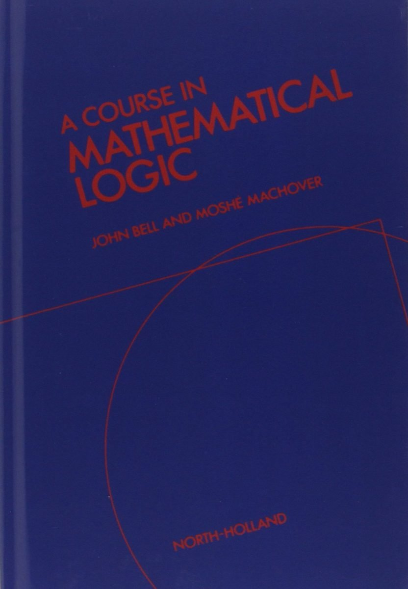

 

Once upon a long time ago, John Bell and Moshé Machover ran a notable one-year masters-level programme on mathematical logic and the foundations of mathematics at London University. They then developed their lecture notes into *A Course in Mathematical Logic* published by North-Holland in 1977. This is a *very* substantial book of 599 pages, and a major achievement in its time, rightly well-regarded back in the day.

But, almost fifty years on, the question inevitably arises: what does it have to offer the reader today compared with more recent texts (in particular, how well is it likely to work for a student launching into a course of self-study?).

As the authors note, various parts of the *Course* had their origins in different lecture courses, and they can often be tackled independently of each other. For example, you don’t need to know the particular details of Bell and Machover’s account of FOL in order to cope with their later discussion of formal arithmetics. It is therefore quite reasonable to chunk up the book into discrete parts, and to assess these separately. So that’s what I’ll do.

Chs 1–3, *Propositional and first-order logic* (pp. 124). There is a lot to like about the first chapter here — in particular the way that both tableaux and axiomatic systems are introduced and interrelated. (Unsigned) tableaux are nicely motivated immediately after the truth-functional semantics for the basic connectives is defined (and we get a proof too that a version of excluded middle could be conservatively added as a tableaux rule). Soundness and a (weak) completeness theorem for tableaux are snappily proved. Then we meet a Hilbert-style proof system, and it is shown directly (i.e. by syntactic proof-manipulations) that this warrants the same deductions as the tableaux system, establishing that the new proof system is complete too. Then we get a proof of weak completeness for our Hilbert system by Kalmar’s method, and a proof of strong completeness by Zorn’s Lemma and the construction of maximal consistent sets. This could be very useful reading for many, drawing various ideas together and showing how they interrelate.

But I can’t in the same way recommend the similarly structured chapters on FOL. Although they start well enough, the semantic story about FOL — in particular when it comes to a laboured discussion of substitution —  soon becomes rather too heavy-handed, and the version of a tableau system for FOL is far from the nicest.

Ch. 4, *Boolean algebras* (pp. 36) This is a nice stand-alone chapter, and it still makes a recommendable introductory account — especially §§1–5.

Ch. 5, *Model theory* (pp. 65) Somewhat action-packed, and lacking some of the helpful classroom asides we find in earlier chapters. There are now more accessible treatments of elementary model theory.

Chs 6–8, *Recursion theory and arithmetic* (pp. 174) Once upon a time, this group of chapters would have been particularly interesting in virtue of its early account of the then relatively-recent MRDP theorem and the use of that theorem in proving further key results. Still pretty readable, but this *is* a topic area with some wonderful alternative  texts. Though for one alternative option on recursion theory and arithmetic, we should certainly note Machover’s more approachable reworking of some of the same material in his own later, shorter, book (though he doesn’t actually prove the MRDP theorem there, referring back to the details here).

Ch 9, *Intuitionistic first-order logic *(pp. 59). There is a useful initial motivating discussion in §§1-4. But we don’t get the clearest of accounts of how the Beth/Fitting tableaux system which is introduced next is supposed to work: de Swart in his chapter on intuitionism, for example, does better. And the rest of the chapter doesn’t give e.g. the nicest introduction to Kripke semantics either. So not the place to start.

Ch. 10, *Set theory *(pp. 72). After more routine introductory sections, the remaining sections — including §5 on reflection principles, §7 on absoluteness, §8 on constructible sets, §9 on the consistency of AC and GCH — could well still be useful supplementary reading for those who already know some elementary set theory. But of course there are many alternatives!

Ch. 11, *Non-standard analysis* (pp. 45). This chapter is a sophisticated but somewhat opaque treatment, a level or two up from most of what has gone before, and rather too remote from the accessible but intriguing entry-level considerations we usually meet in introductory accounts of Robinson-style constructions. Certainly not for the faint-hearted.

*Summary verdict* An exceptional book in its day, still worth revisiting in part.
