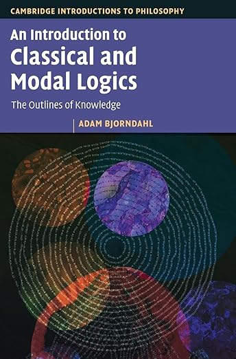

Adam Bjorndahl’s contribution to the Cambridge Introductions to Philosophy series, *An Introduction to Classical and Modal Logics*  strikes me as a rather odd book, both in terms of level and in terms of coverage. So before getting critical, let me say that I *do* like its approachable style and tone. And there is a page-layout device which works rather well, of having mini-comments and further explanations in the margins, keeping the main flow of text more economically focused. (Unfortunately, the version made available online through the Cambridge Core system completely fouled-up this aspect of the text when I saw it.)

This is a short book. So after a brief Introduction, propositional logic and predicate logic are polished off in two chapters, just 80 pages (with relatively narrow columns of main text, set quite generously spaced). And yet we get as far as a completeness proof for predicate logic. So who is the intended reader? A philosophical newbie with no mathematical background will most surely struggle.

In fact, the book really seems aimed at students also doing maths (or maths as well as philosophy). The very first words of the Introduction are “Mathematics is the systematic structure of patterns and structure ... What if we turn this focus inward, and engaged in the systematic study of mathematics itself? This is one way of understanding what logic is.” Later, to take just one example, we are told to take the domain of interpretation in a completeness proof for FOL with identity to be the quotient of the set of terms by the equivalence relation of provable equality. This is the first mention of the idea of a quotient. A marginal comment to the rescue? “For a refresher on equivalence relations and quotients, see Appendix A2”. Refresher? So the reader is already supposed to have encountered such ideas.

I could continue; but I suggest we just forget that this book is officially masquerading as an introduction for philosophers. Would the chapters on PL and FOL work for suitably mathematically primed students? As I said, the presentational style is congenial. But to my mind we get rather too little, rather too fast. On propositional logic, we get a speedy account of the two-valued connectives and truth-tables, an introduction to a Hilbert-style deductive calculus (!), followed by soundness and completeness proofs. Topics that should give the thoughtful student pause -- e.g. the truth-functional conditional, explosion -- can whizz by. On FOL, we meet the syntax, semantics and a Hilbert-style deductive calculus all within 24 pages, before proceeding to soundness and completeness proofs. Technically fine, as far as I can see: but less accessible than the best alternatives. And by my lights, someone working at this level would do significantly better with a more expansive treatment as in Enderton’s classic book or other options suggested in the Guide; and there is now Westerståhl’s excellent text as well (where you’ll also learn e.g. about natural deduction).

The second part of Bjorndahl’s book starts with a chapter on propositional modal logic. This gets quite technical quite quickly and is all given what strikes me as a strangely epistemic twist. Indeed the traditional interpretation S5 in terms of logical necessity is -- unless my attention flickered -- never discussed. The official audience of philosophy students would want a gentler account that links up better to discussions of logical and metaphysical necessity.

In passing, I note that Bjorndahl suggests that “Alice believes $\varphi$” can be interpreted as saying something like “$\varphi$ is true in all configurations of the world that Alice considers possible”. Really? For a start, what does “considers possible” mean here if not “believes to be possible”. And “possible” in what sense? Consistent with what she believes? 

The chapter on modal logic is followed by, of all things, a chapter on Group Knowledge (an interest of Bjorndahl’s but for me way off the menu of initial topics you need to meet when starting out on modal logic). Then, crunching the gears, there is a 14 page final chapter on topological semantics. If you are going there, you’d expect to hear about intuitionistic logic; yet that only gets a glancing mention back on p.3.  Odd.

There are lots of of good treatments out there of PL and FOL; there are lots of good treatments of modal logic too (also covering the sorts of quantified logics of current interest to philosophers). Despite its often reader-friendly tone, Bjorndahl’s book won’t be joining, let alone displacing, existing recommendations in the Guide.