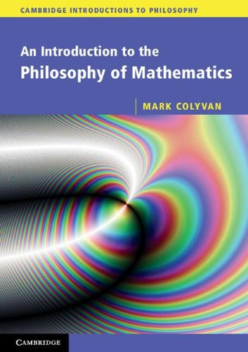

 

Ever since my Gödel book was published unexpectedly as one of the  “Cambridge Introductions to Philosophy”, I’ve kept an interested eye on what else has appeared in the series. One contribution is Mark Colyvan’s* An Introduction to the Philosophy of Mathematics* (CUP, 2012). I have to say that this is very disappointing.

The blurb says “The book is suitable for an undergraduate course in phil. maths”. But not for many, I would hazard. Such courses are nearly always upper-level courses (well, that is certainly the case in the UK, and surely it isn’t different elsewhere), but the discussions in this book are very much at an elementary level, and very little is pursued in any depth at all. Chapter 2, for example, is on “The limits of mathematics”. There are just five pages on the Löwenheim-Skolem theorem and Skolem’s Paradox, of which three and a bit are purely expository. Then, rather bizarrely, there are just three pages on Gödel’s Theorems, and that includes telling the reader what they are.

The sense of onward rush continues. The whole book (minus the rather random epilogue which lists a number of mathematical theorems which Colyvan thinks that any philosopher of mathematics should know about) comes in at 150 pages, and rather spaciously set pages at that. So this just hasn’t the space for the kind of coverage and argumentative sophistication that you’d want in a book that is going to provide the backbone for a mid- or upper-level undergraduate course.

Colyvan starts the book by saying what he isn’t going to be talking about — the familiar menu of “isms”, logicism (old and new), formalism, intuitionism. Instead we get Platonism, structuralism, nominalism, fictionalism. That reflects the concerns of a lot of post-Benaceraff philosophy of mathematics, but it is certainly not all gain. If you ask which philosophical debates actually engage with the concerns of reflective mathematicians (or at least, with questions you can get them interested in for half and hour over coffee), then the list will cross-cut the old and new isms. Eyes glaze over if you try to amuse your local mathematicians with (neo)logicism or with fictionalism. But questions about what can be rescued from Hilbert’s program (cp. the reverse mathematics program), related issues about how little it takes to do how much, questions about the idea of structure (and what category theory brings to the party when thinking about structure), issues about which set theories are worth taking seriously (NF anyone?), questions about if/when/how we should prefer constructively acceptable proofs, etc., can still produce animation. Now, I’m not suggesting that all those latter topics should be touched on in a first phil. maths course. But I do think that there is something to be said for shaping the introductory menu with an eye to laying the groundwork for moving on to ‘real’ debates (as opposed to the rather regrettable in-house obsessions of recent philosophers).

The book moves on to discuss four topics beyond the isms  — so you can see how fast Colyvan must be going! It discusses the idea of mathematical explanation (both explanation within mathematics, and apparent cases of the mathematical explanation of the extra-mathematical), the “unreasonable effectiveness of mathematics” in applications, there’s a chapter entitled “Who is afraid of inconsistent mathematics?”, and finally there is a chapter that says it is about ‘notation’ but is actually about something a bit deeper concerning representations (e.g. the use of cartesian vs. homogeneous coordinates for the plane).

Two comments. First on (intra)mathematical explanation: yes, this is an intriguing topic. The trouble is the Colyvan tries to discuss this with too few actual examples of mathematical proofs (note that his epilogue is a catalogue of results, not of proofs, so is going to be no help here). One of the few proofs he gives is (a rather heavy-handed version of) Euclid’s proof of the infinitude of primes. Now, this is the first of the *Proofs from The Book* in Aigner and Ziegler, who go on to give five other reasonably elementary proofs of the same result: it would have been fun to look at one or two of these other proofs too and do a compare-and-contrast for “explanatoriness”. As it is, the restricted diet of examples leaves the discussion floundering.

Second, on inconsistent theories. Leaving aside the special case of the rise, fall, and rise of infinitesimal analysis, talk of mathematicians working with inconsistent theories can be much overdone. Colyvan early on in the book writes of Russell “proving that the foundational mathematical theory, set theory, was inconsistent”. But we are (of course!) not told in just what sense “set theory” was “foundational”, or indeed just *which* set theory is in question. Here’s a very useful exercise. Take a look at William and Grace Young’s wonderfully lucid *The Theory of Sets of Points*, published in 1906 — so after Russell’s Paradox was known but before Zermelo’s axiomatisation — and still in print). They are doing foundational work in one good sense. Ask yourself how and why they can do so much and can be unfazed by Russell’s paradox. And of course it isn’t because they are proto paraconsistent logicians of the kind Colyvan talks about here!

Given the lack of depth because of covering so much in such a short space, I can’t really see this book being much used as a course book (it won’t trump options like e.g. Marcus Giaquinto’s exemplary *The Search for Certainty* for part of a course).  It is, however, very attractively and mostly pretty clearly written even if it skips past far too fast: so I suppose Colyvan could be a good recommendation for not-too-challenging warm-up reading vacation reading before the course kicks off.
