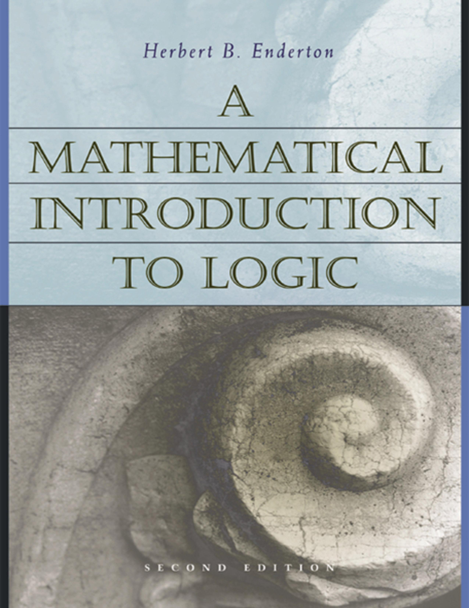

 

The first edition of Herbert B. Enderton’s *A Mathematical Introduction to Logic* (Academic Press, 1972: pp. 295) rapidly established itself as a much-used textbook among the mathematicians it was aimed towards. But it has also been used  too in many math. logic courses offered to philosopers. A second edition was published in 2002, and a glance at the section headings indicates much the same overall structure: but there are many local changes and improvements, and I’ll comment here on this later version of the book (which by now should be equally widely available in libraries).

Enderton’s text deals with first order-logic and a smidgin of model theory, followed by a look at formal arithmetic, recursive functions and incompleteness. A final chapter covers second-order logic and some other matters.

*A Mathematical Introduction to Logic* eventually became part of a logical trilogy, with the publication of the wonderfully lucid *Elements of Set Theory* (1977) and *Computability Theory* (2010). The later two volumes strike me as masterpieces of exposition, providing splendid ‘entry level’ treatments of their material. The first volume, by contrast, is *not* the most approachable first pass through its material. It is good (often *very* good), but I’d say at a notch up in difficulty from what you might be looking for in an *introduction* to the serious study of first-order logic and/or incompleteness.

---

*Some details *After a brisk Ch. 0 (‘Some useful facts about sets’, for future reference), Enderton starts with a 55 page Ch. 1, ‘Sentential Logic’. Some might think this chapter to be slightly odd. For the usual motivation for separating off propositional logic and giving it an extended treatment at the beginning of a book at this level is that this enables us to introduce and contrast the key ideas of semantic entailment and of provability in a formal deductive system, and then explain strategies for soundness and completeness proofs, all in a helpfully simple and uncluttered initial framework. But (except for some indications in final exercises) there is no formal proof system mentioned in Enderton’s chapter. So what does happen in this chapter? Well, we do get a proof of the expressive completeness of { ∧ ,  ∨ , ¬}, etc. We also get an exploration (which can be postponed) of the idea of proofs by induction and the Recursion Theorem, and based on these we get proper proofs of unique readability and the uniqueness of the extension of a valuation of atoms to a valuation of a set of sentences containing them (perhaps not the most inviting things for a beginner to be pausing long over). We get a direct proof of compactness. And we get a first look at the ideas of effectiveness and computability.

The core Ch. 2, ‘First-Order Logic’, is over a hundred pages long, and covers a good deal. It starts with an account of first-order languages, and then there is a lengthy treatment of the idea of truth in a structure. This is pretty clearly done and mathematicians should be able to cope quite well (but does Enderton forget his officially intended audience on p. 83 where he throws in an unexplained commutative diagram?). Still, readers might sometimes appreciate rather more explanation (for example, surely it would be worth saying a bit more than that ‘In order to define ‘*σ* is true in $latex \frak{A}$’for sentences *σ* and structures $latex \frak{A}$, we will find it desirable [sic] first to define a more general concept involving wffs’, i.e. satisfaction by sequences). Enderton then at last introduces a deductive proof system (110 pages into the book). He chooses a Hilbert-style presentation, and if you are not already used to such a system, you won’t get much of a feel for how they work, as there are very few examples before the discussion turns to metatheory (even Mendelson’s presentation of a similar Hilbert system is here more helpful). Then, as you’d expect, we get the soundness and completeness theorems. The proof of the latter by Henkin’s method *is* nicely chunked up into clearly marked stages, and again a serious mathematics student should cope well: but this is still not, I think, a ‘best buy’ among initial presentations.The chapter ends with a little model theory – compactness, the LS theorems, interpretations between theorems – all rather briskly done, and there is an application to the construction of infinitesimals in non-standard analysis which is surely going to be *too* compressed for a first encounter with the ideas.

Ch. 3, ‘Undecidability’, is also a hundred pages long and again covers a great deal. After a preview introducing three somewhat different routes to (versions of) Gödel’s incompleteness theorem, we initially meet:
- A theory of natural numbers with just the successor function built in (which is shown to be complete and decidable, and a decision procedure by elimination of quantifiers is given).
- A theory with successor and the order relation (also shown to admit elimination of quantifiers and to be complete).
- Presburger arithmetic (shown to be decidable by a quantifier elimination procedure, and shown not to define multiplication)
- Robinson Arithmetic with exponentiation.

The discussion then turns to the notions of definability and representability. We are taken through a long catalogue of functions and relations representable in Robinson-Arithmetic-with-exponentiation, including functions for encoding and decoding sequences. Next up, we get the arithmetization of syntax done at length, leading as you’d expect to the incompleteness and undecidability results.

But we aren’t done with this chapter yet. We get (sub)sections on recursive enumerability, the arithmetic hierarchy, partial recursive functions, register machines, the second incompleteness theorem for Peano Arithmetic, applications to set theory, and finally we learn how to use the *β*-function trick so we can get take our results to apply to any nicely axoimatized theory containing plain Robinson Arithmetic.

As is revealed by that quick description there really is a *lot* in Ch. 3. To be sure, the material here is not mathematically difficult in itself (indeed it is one of the delights of this area that the initial Big Results come so quickly). However, I do doubt that such an action-packed presentation is the best way to first meet this material. It would, however, make for splendid revision-consolidation-extension reading after tackling e.g. my Gödel book.

The final Ch. 4 is much shorter, on ‘Second-Order Logic’. This goes *very* briskly at the outset. It again wouldn’t be my recommended introduction for this material, though it could make useful supplementary reading for those wanting to get clear about the relation between second-order logic, Henkin semantics, and many-sorted first-order logic.

---

*Summary verdict *To repeat, *A Mathematical Introduction to Logic* is good in many ways, but is – in my view – often a step or two more difficult in mode of presentation than will suit many readers wanting an introduction to the material it covers. However, if you have already read an entry-level presentation of first order logic (e.g. Chiswell/Hodges) then you could read Chs 1 and 2 as revision/consolidation. And if you have already read an entry-level presentation on incompleteness (e.g. my book) then it could be very well worth reading Ch. 3 as bringing the material together in a somewhat different way.
