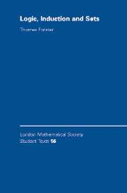

 

Thomas Forster’s *Logic, Induction and Sets* (CUP, 2003: pp. x+234) is rather quirky, and some readers will enjoy it for exactly that reason. It is based on a wide-ranging lecture course given to Cambridge mathematicians who – such being the strcuture  of the tripos syllabus – at the beginning of the course already knew a good deal of maths but very little logic. The book is very bumpily uneven in level, and often goes skips forward very fast, so I certainly wouldn’t recommend it as an ‘entry level’ text on mathematical logic for someone wanting a conventionally systematic approach. But it is often intriguing.

---

*Some details *Ch. 1 is called ‘Definitions and notations’ but is rather more than that, and includes some non-trivial exercises: but if you are dipping into later parts of the book, you can probably just consult this opening chapter on a need-to-know basis.

Ch. 2 discusses ‘Recursive datatypes’, defined by specifying a starter-pack of ‘founders’ and some constructors, and then saying the datatype is what you can get from the founders by applying and replying the constructors (and nothing else). The chapter considers a range of examples, induction over recursive datatypes, well-foundedness, well-ordering and related matters (with some interesting remarks about Horn clauses too).

Ch. 3 is on partially ordered sets, and we get a lightning tour through some topics of logical relevance (such as the ideas of a filter and an ultrafilter).

Chs. 4 and 5 deal slightly idiosyncratically with propositional and predicate logic, and could provide useful revision material (there’s a slip about theories on p. 70, giving two non-equivalent definitions).

Ch. 6 is on ‘Computable functions’ and is another lightning tour, touching on quite a lot in just over twenty pages (getting as far as Rice’s theorem). Again, could well be useful to read as revision, especially if you want to highlight again the Big Ideas and their interrelations.

Ch. 7 is on ‘Ordinals’. Note that Forster gives us the elements of the theory of transfinite ordinal numbers *before* turning to set theory in the next chapter. It’s a modern doctrine that ordinals just *are* sets, and that the basic theory of ordinals is part of set theory; and in organizing his book as he does, Forster comes nearer than most to getting the correct conceptual order into clear focus (though even he wobbles sometimes, e.g. at p. 182). However, the chapter could have been done more clearly.

Ch. 8 is called ‘Set Theory’ and is perhaps the quirkiest of them all – though not because Forster is here banging the drum for non-standard set theories (surprisingly given his interests, he doesn’t). But the chapter is oddly structured, so for example we get a quick discussion of models of set theory and the absoluteness of Δ0 properties *before* we actually encounter the ZFC axioms. The chapter is probably only for those, then, who already know the basics.

Ch. 9 comprises answers to some of the earlier exercises – exercises are indeed scattered through the book, and some of them are rather interesting.

---

*Summary verdict D*ifferent from the usual run of textbooks, not a good choice for beginners. However, if you already have encountered some of the material in one way or the other, Forster’s book could very well be worth looking through for revision and/or to get some new perspectives.
