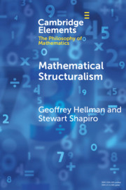

CUP are publishing a series of short books (about 100 pages) under the title Cambridge Elements in the Philosophy of Mathematics. The blurb says that the series “provides an extensive overview of the philosophy of mathematics in its many and varied forms. Distinguished authors will provide an up-to-date summary of the results of current research in their fields and give their own take on what they believe are the most significant debates influencing research, drawing original conclusions.” Which *sounds* ambitious. So far, just two Elements have been published, *Mathematical Stucturalism* (2018) by Geoffrey Hellman and Stewart Shapiro, and *A Concise History of Mathematics for Philosophers* (2019) by John Stillwell.

The hyper-active Stillwell has already written a well-known and accessible *Mathematics and Its History* (3rd edn, 2010) as well as a number of other non-specialist books (alongside his singificantly better hard-core maths texts). It seems a bit of a failure of imagination for the series editors to ask him to write *another* history; and to me, the result looks pretty unexciting.

Again, getting Hellman and Shapiro to write on structuralism is hardly adventurous! But I have now read their book. It’s not clear, though, who the intended readership really is. The series blurb — “up-to-date summary”, “current research”, “original conclusions” — might suggest a book aimed at e.g. graduate students. But little of the book approaches that sort of level. (One odd feature: we aren’t told who wrote what, even though some of the passages are in the first person and are characteristic of just one of the authors.)

There is a short Introduction giving initial characterizations of some forms of mathematical structuralism, and setting out some questions that we’d want any structuralism to address. Chapter 2 gives Historical Background. This is over twice the length of the next longest chapter and it is nicely done, with a good selection of quotations;   it will provide very helpful reading for undergraduates. Chapter 3 is then on Set-Theoretic Structuralism, the view that “structures are isomorphism types (or representatives thereof) within the set-theoretic hierarchy”.

Of course, this view won’t in itself give us structuralism for mathematics across the board: the status of set theory itself is left up for grabs. Indeed, on the obvious story “the foundational theory [set theory] is an exception to the theme of structuralism. But, the argument continues, every other branch of mathematics is to be understood in eliminative structuralist terms.” The authors don’t do much, however, to explain *why* set theory should get this foundational role, or illuminate how this reductionist story squares with the familiar fact that most working mathematicians can get by in cheerful ignorance of set theory, etc.  A student could be better pointed to e.g. some of Maddy’s work for a more nuanced account of the role of set theory in mathematics.

Chapter 4 is on Category Theory as a Framework for Mathematical Structuralism. But who is this short chapter addressed to? The philosophy of maths student (at any level) should have some initial grasp on what set theory is about. But most won’t have much clue about what Category Theory might be, and these brisk arm-waving pages are unlikely to help at all. On the other hand, the few who are in the game will be familiar with the usual suggestions from Awodey and others which are gestured to here: for them, there will be no news, certainly no “original conclusions”.

Chapter 5 and 6 discusses Structures as *Sui Generis* Structuralism (Shapiro-style) and The Modal-Structural Perspective (Hellman-style). Both authors have been presenting their respective lines for well over twenty years, and so we are not going to expect any exciting new insights, criticisms or developments — and in under a dozen printed pages for each chapter, we don’t get them.

The final Chapter 7 is on Modal Set-Theoretic Structuralism, in particular as developed by Øystein Linnebo. This topic is at least relatively novel and is interesting; but since the authors are nowhere near as good at explaining Linnebo’s approach as that particularly lucid author is, the sufficiently equipped student reader would do a lot better to go to the original paper “The Potential Hierarchy of Sets,” *Review of Symbolic Logic* (2013).

Which all sounds rather carping. But overall I found this an extremely disappointing book.
