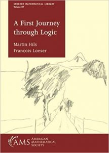

 

*A First Journey through Logic* by Martin Hills and François Loeser was published in the AMS Student Mathematical Library in 2019. “The book starts with a presentation of naive set theory, the theory of sets that mathematicians use on a daily basis. Each subsequent chapter presents one of the main areas of mathematical logic: first order logic and formal proofs, model theory, recursion theory, Gödel’s incompleteness theorem, and, finally, the axiomatic set theory. Each chapter includes several interesting highlights— outside of logic when possible either in the main text, or as exercises or appendices.” Which is a promising prospectus, with its chapters covering just the same main topics as Chapters 2 to 7 of the Study Guide. However, this is a book of under two hundred small-format pages. Which rather suggests that either the authors aren’t aiming to get very far on any particular topic (though such a book can be very useful when well done, cf. Robert Wolf’s *A Tour Through Mathemtical Logic*). Or else our authors must have written with considerable compression at the probable cost of ready accessibility.

I’m afraid that our authors have taken the second line. They say they have “deliberately chosen not to write another comprehensive textbook, of which there already exist quite a few excellent ones, but instead to deliver a slim text which provides direct routes to some significant results of general interest.” But they also say that the book is intended for “undergraduate students, graduate students at any stage, or working mathematicians, who seek a first exposure to core material of mathematical logic and some of its applications.” So we are led to expect the chapters here to be accessible to beginners on a topic, though perhaps beginners with a reasonable level of mathematical maturity. But the book, we are told, originates from a course taught at École Normale Supérieure: and it reads exactly like souped-up lecture notes spelling out carefully lots of technical details, to back up a course of lectures which explain the rationales for the various formal constructions. But without the explanatory, arm-waving, motivational chat, the arid formal details make for a hard and uninviting read. Surely they not the place to start on a first journey through logic.

---

Chapter 1 is called “Counting to Infinity”, and is more-or-less entirely a fast-track introduction to ordinals and then cardinals treated set-theoretically but informally (i.e. without getting entangled with formalized ZFC). Before the exercises start, this is just 21 relentless pages of definitions/theorems/proofs with very little by way of explanatory  chat. To take just one example, the naive reader may very well wonder why ordinal exponentiation is defined in terms of functions with finite support (a notion which is defined, used once, and never motivated). What kind of reader is going to find this sort of presentation helpful? Perhaps as after-the-event lecture notes, following on from more informal presentations, these pages might have been useful to those attending the course from which these notes arise. But as a stand-alone text, the body of this chapter has nothing to recommend it. (There is some interest in the exercises though.)

Chapter 2, “First-order Logic” is if anything worse. It is a baldly presented gallop through a Mendelson-style axiomatic system (with particularly dense thickets of symbols along the way). I really can’t imagine anyone coming away from, e.g., the completeness proof with a good sense of what’s going on: there are so many, much better, treatments out there.

Chapter 3 is “First Steps in Model Theory”. We get Tarski-Vaught after 3 pages (compare, after 43 pages of Kossak’s *Model Theory for Beginners*, and after 66 pages of Kirby’s  *An Invitation to Model Theory*), and we get quantifier elimination after 8 pages (not treated by Kosssak, and Kirby takes 97 pages to introduce the idea). We get to Ax’s Theorem in 16 pages. I wonder how many will be illuminated by this sort of ultra-rushed tour?

Chapter 4 is on “Recursive Functions”, defining primitive recursive, partial recursive and total recursive functions, touching on Turing machines (without a single diagram or a single program illustrated), proves the Turing-computable functions are recursive, proves the unsolvability of the halting problem, etc. Now, this is markedly less sophisticated material than the model theory in the previous chapter, so this present chapter is probably quite a bit more accessible. But on the other hand, there is zero elegance here, and yet this is an area where we can make the concepts and the proof-ideas look so delightful (and thereby engender a good understanding). So I again can’t recommend this as a good read.

And here I gave up. Sorry to be so consistently negative: but take it as a community service to warn off any unwary readers.
