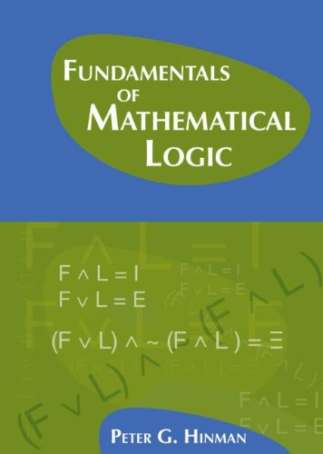

 

Now for a really *big* Big Book – Peter G. Hinman’s *Fundamentals of Mathematical Logic* (A.K.Peters, 2005: pp. 878). The author says the book was written over a period of twenty years, as he tried out various approaches ‘to enable students with varying levels of interest and ability tocome to a deep understanding of this beautiful subject’.

But I suspect that you will need to be mathematically quite strong to really cope with this book: whatever Hinman’s intentions for a wider readership, this is not for the fainthearted. The book’s daunting size is due to its very wide coverage rather than a slow pace – so after a long introduction to first-order logic (or more accurately, to its model theory) and a discussion of the theory of recursive functions and incompleteness and related results, there follows a *very* substantial survey of set theory, and then lengthy essays on more advanced model theory and on recursion theory. As too often, proof theory is the poor relation here – indeed Hinman is very little interested in deductive systems for logic, which don’t make an appearance until over two hundred pages into the book.

Let me mention at the outset what strikes me as a pretty unfortunate global notational convention, which might puzzle casual browsers or readers who want to start some way through the book, Given the two-way borrowing of notation between informal mathematics and the formal languages in which logicians regiment that mathematics, it is good to have some way of visually distinguishing the formal from the informal (so we don’t just rely on context). One common method is font selection. Thus, even in an informal context, we may snappily say that addition commutes by writing e.g. ∀*x*∀*y* *x* + *y* = *y* + *x*; the counterpart wff for expressing this in a fully formalized language by writing the same in  sans serif (or using another font selection). Hinman, however, prefers using an ‘(informal)mathematical sign with a dot over it to represent a formal symbol in a formallanguage which denotes the informal object’, so he’d write $latex \forall x\forall y\, x\,\dot{+}\,y \ \dot{=}\ y\,\dot{+}x$ for the formal wff. As you can imagine, this convention eventually leads to really nasty rashes of dots – for example, to take a relatively tame example from p. 459, we get** $latex \dot{\bigcup}\ x\ \dot{=}\ \dot{\{} z \colon \exists v [v\,\dot{\in}\,x \land z\,\dot{\in}\,v]\}$

(note how even opening braces in formal set-former notation get dotted). This dottiness quite surely isn’t a happy choice!

---

*Some details *Hinman himself in his Preface gives some useful pointers to routes through the book, depending on your interests.The Introduction gives a useful and approachable overview of some key notions tied up with the mathematical logician’s project of formalization (and talks about a version of Hilbert’s program as setting the scene for some early investigations).

Ch. 1 is on ‘Propositional Logic and other fundamentals’. §§1.1, 1.3 and 1.4 are devoted to the language of propositional logic, and give the usual semantics, define the notion tautological entailment and explore its properties, giving a proof of the compactness theorem. But note, there is no discussion at all here – or in the other sections of this chapter – of a proof-system for propositional logic. §1.2 is a rather general treatment of proofs by induction and the definition of functions by recursion (signposted as skippable at this early stage – and indeed the generality doesn’t make for a particularly easy read for a section so early in the book). §§1.6 and 1.7 also cover more advanced material, mainly introducing ideas for later use: the first briskly deals e.g. with ultrafilters and ultraproducts (we get another take on compactness), and the second relates compactness to topological ideas and also introduces the idea of a Boolean algebra.

Ch. 2, ‘First-order logic’, presents the syntax and semantics of first-order languages, and then talks about first-order structures (isomorphisms, embeddings, extensions, etc), and proves the downward L-S theorem. We then get a general discussion of theories (thought of as sets of sentences closed under *semantic* consequence), and an extended treatment of some examples (the theory of equality, the theory of dense linear orders, and various strengths of arithmetic). There’s some quite sophisticated stuff here, including discussion of quantifier elimination. But there is still no discussion yet of a proof-system for first-order logic, so the chapter could as well, if not better, have been called ‘Elements of model theory’.Ch. 3, ‘Completeness and compactness’, starts with a compactness proof for countable languages. Then we at last have a *very* brisk presentation of an old-school axiomatic system for first-order logic (I told you that Hinman is not interested in proof-systems!), and a proof of completeness using the Henkin construction that has already been used in the compactness proof. We next get – inter alia – an algebraic proof of compactness for first-order consequence via ultraproducts, and a return to Boolean algebras and e.g. the Rasiowa-Sikorski theorem (§3.3); an extension of the compactness and completeness results to uncountable languages (§3.4); and some heavy-duty applications of compactness (§3.5). Finally in this action-packed chapter, we have some rather unfriendly treatments of higher-order logic (§3.6) and infinitary logic (§3.7).

Let’s pause for breath. We are now a bit over 300 pages into the book. Things have already got pretty tough. The book is not quite a relentless march along a chain of definitions/theorems/corollaries; there are just enough pauses for illustrations and helpful remarks en route to make it a bearable. But Hinman does have a taste for going straight for abstractly general formulations (and his notational choices can sometimes be unhappy too). So as indicated in my preamble, the book will probably only appeal to mathematicians already used to this sort of fairly hardcore approach. In sum, therefore, I’d only recommend the first part of the book to the mathematically minded who already know their first-order logic and a bit of model theory; but such readers might then find it quite helpful as a beginning/mid-level model theory resource.

On we go. Next we have two chapters (almost 150 pages between them) on recursive functions, Gödelian incompleteness, and related matters. Perhaps it is because these topics are conceptually easier, more ‘concrete’, than what’s gone before, or perhaps it is because the topics are closer to Hinman’s heart, but these chapters seem to me to work better as an introduction to their topics. In particular, while not my favourite treatment, Ch. 4 is clear, very sensibly structured, and should be accessible to anyone with some background in logic and who isn’t put off by a certain amount of mathematical abstraction. The chapter opens with informal proofs of the undecidability of consistent extensions of Q, the first incompleteness theorem and Tarski’s theorem on the undefinability of truth (as well as taking a first look at the second incompleteness theorem). These informal proofs depend on the hypothesis that effectively calculable functions are expressible or the hypothesis that such functions are representable (we don’t yet have a formal story about these functions). Unsurprisingly, given I do something in the same ball-park in my Gödel book, I too think this is a good way to start and to motivate the ensuing development. There follows, as you’d expect, the necessary account of the effectively calculable in terms of recursiveness, and then we get proofs that recursive functions can be expressed/represented in arithmetic, leading on to formal versions of the theorems about undecidable and incompleteness. This presentation takes a different-enough path through the usual ideas to be worth reading even if you’ve already encountered the material a couple of times before.

Ch. 5 is called ‘Topics in definability’ and, unlike the previous rather tightly organised chapter, is something of a grab-bag of topics. §5.1 says something about the arithmetical hierarchy; §5.2 discusses inter alia the indexing of recursive functions and the halting problem; §5.3 explains how the second incompleteness theorem is proved, and – while not attempting a full proof – there is rather more detail than usual about how you can show that the HBL derivability conditions are satisfied in PA. Then §5.4 gives more evidence for Church’s Thesis by considering a couple of other characterisations of computability (by equation manipulation and by abstract machines) and explains why they again pick out the recursive functions. §5.5 discusses ‘Applications to other languages and theories’ (e.g. the application of incompleteness to a theory like ZF which is not initially about arithmetic). These various sections are all relatively clearly done.

Pausing for breath again, we might now try to tackle Ch. 6 on set theory (whose 200 pages amount by themselves to an almost-stand-alone book). The menu covers the basics of ZF, the way we can construct mathematics inside set theory, ordinals and cardinals, then models and independence proofs, the constructible universe, models and forcing, large cardinals and determinacy. But even from the outset, this does seem quite relentlessly hard going, too short on motivation and illustrations of concepts and constructions. Dense, to say the least. The author says of the chapter that his particular mode of presentation means that ‘for each of the instances where one wants to verify that something is a class model – the intuitive universe of sets V, the constructible universe L and a forcing extension m[*G*] – … the proofs …  exhibit more of the underlying unity.’ So enthusiasts who know their set theory might want to do a fast read of the chapter to see if they can glean new insights. But I can’t recommend this as a way into set theory when compared with the standard set theory texts mentioned in the Guide.

Ch. 7 returns to more advanced model theory for another 80 pages, getting as far Morley’s theorem. Again, if you want a more accessible initial treatment, you’ll go for Hodges’s *Shorter Model Theory*. And then why not tackle Marker’s book if you are a graduate mathematician?

Finally, there’s another equally long chapter on recursion theory. The opening sections on degrees and Turing reducibility are pretty approachable. The rest of the chapter gets more challenging but (at least compared with the material on model theory and set theory) should still be tolerably accessible to those willing to put in the work.

---

*Summary verdict *It is *very* ambitious to write a book with this range and depth of coverage (as it were, an expanded version of Shoenfield, forty years on – but now when there is already a wealth of textbooks on the various areas covered, at various levels of sophistication). After such a considerable labour from a good logician, it seems very churlish to say it, but the treatments of, respectively, (i) first-order logic, (ii) model theory, (iii) computability theory and incompleteness, and (iv) set theory aren’t as good as the best of the familiar stand-alone textbooks on the four areas. And I can’t see that these shortcomings are balanced by any conspicuous advantage in having the accounts in a single text, rather than a handful of different ones. Still, the text should be in any university library, as enthusiasts might well find parts of it quite useful supplementary/reference material. Chapters 4, 5 and 8 on computability and recursion work the best.
