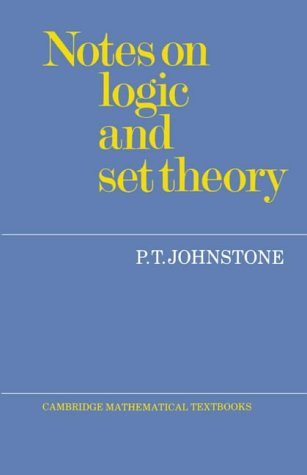

 

Peter T. Johnstone’s *Notes on Logic and Set Theory* (CUP, 1987: pp. 111) is very short in page length, but very big in ambition. There is an introductory chapter on universal algebra, followed by chapters on propositional and first-order logic. Then there is a chapter on recursive functions (showing that a function is register computable if and only if computable, and that such functions are representable in PA). That is followed by four chapters on set theory (introducing the axioms of ZF, ordinals, AC, and cardinal arithmetic). And there is a final chapter ‘Consistency and independence’ on Gödelian incompleteness and independence results in set theory.

This is a quite remarkably action-packed menu for such a short book. The book started life  as notes for undergraduate lectures for the maths tripos (with the story to be filled out a bit by working at the substantive exercises). But this is surely not the book to use for self-study in a first encounter with these ideas. However, I would warmly recommend the book as an outstanding resource for revision and/or consolidation: its very brevity means that the Big Ideas get highlighted in a particularly uncluttered way, and particularly snappy proofs are given.
