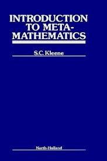

 

First published seventy years ago, Stephen Cole Kleene’s *Introduction to Metamathematics* (North-Holland, 1952; reprinted Ishi Press 2009: pp. 550) held the field for a while as a survey treatment of first-order logic (without going much past the completeness theorem) followed by a more in-depth treatment of the theory of computable functions and Gödel’s incompleteness theorems.

In a later note about writing the book, Kleene remarks that up to 1985, about 17,500 copies of the English version of his text were sold, as were thousands of various translations (including a sold-out first print run of 8000 of the Russian translation). So this is a book with a quite pivotal influence on the education of whole generations of later logicians, and on their understanding of the fundamentals of recursive function theory and of the incompleteness theorems in particular.

And it isn’t just nostalgia that makes old hands continue to recommend it. Kleene’s book remains particularly lucid and accessible: it is often discursive, pausing to discuss the motivation behind formal ideas. It is still a pleasure to read — or at least, it ought to be a pleasure for anyone interested in logic enough to be reading this ! And, modulo relatively superficial presentational matters, you’ll probably be struck by a sense of familiarity when reading through, as aspects of his discussions evidently shape many later textbooks (not least my own Gödel book).

The *Introduction to Metamathematics* remains a really impressive achievement: and not one to be admired only from afar, either.

---

*Some details * Chs. 1–3 are introductory. There’s a little about enumerability and countability (Cantor’s Theorem); then a chapter on natural numbers, induction, and the axiomatic method; then a little tour of the paradoxes, and possible responses.

Chs. 4–7 are a gentle introduction to the propositional and predicate calculus and to a formal system which is in fact first-order Peano Arithmetic (you need to be aware that the identity rules are treated as part of the arithmetic, not the logic). Although Kleene’s official system is Hilbert-style, he shows that ‘natural deduction’ introduction and elimination rules can be thought of as derived rules in his system, so it all quickly becomes quite user-friendly. (He doesn’t at this point prove the completeness theorem for his predicate logic: as I said, things go quite gently at the outset!)

Ch. 8 starts work on ‘Formal number theory’, showing that his formal arithmetic has nice properties, and then defines what it is for a formal predicate to capture (‘numeralwise represent’) a numerical relation. Kleene then sets up Gödel coding and proves Gödel’s incompleteness theorem, assuming a Lemma — eventually to be proved in his Chapter 10 — about the capturability of the relation ‘*m* numbers a proof [in Kleene’s system] of the sentence with code number *n*‘.

Ch. 9 gives an extended treatment of primitive recursive functions, and then Ch. 10 deals with the arithmetization of syntax, yielding the Lemma needed for the incompleteness theorem.

Chs. 11–13 then give a nice treatment of general (total) recursive functions, partial recursive functions, and Turing computability. This is all very attractively done.

That leaves the final two chapters, in fact forming almost a quarter of the book under the heading ‘Additional Topics’. In Ch. 14, after proving the completeness theorem for the predicate calculus without and then with identity, Kleene discusses the decision problem. And the final Ch. 15 discusses Gentzen systems, the normal form theorem, intuitionistic systems and Gentzen’s consistency proof for arithmetic.

---

*Summary verdict *Kleene’s classic can still be warmly recommended as an enjoyable and illuminating presentation of this fundamental material, written by someone who was himself so closely engaged in the early developments back in the glory days. It should be entirely accessible if you have managed a modern introduction to FOL and perhaps already met Gödel’s theorem, and it will certainly enrich and broaden your understanding.
