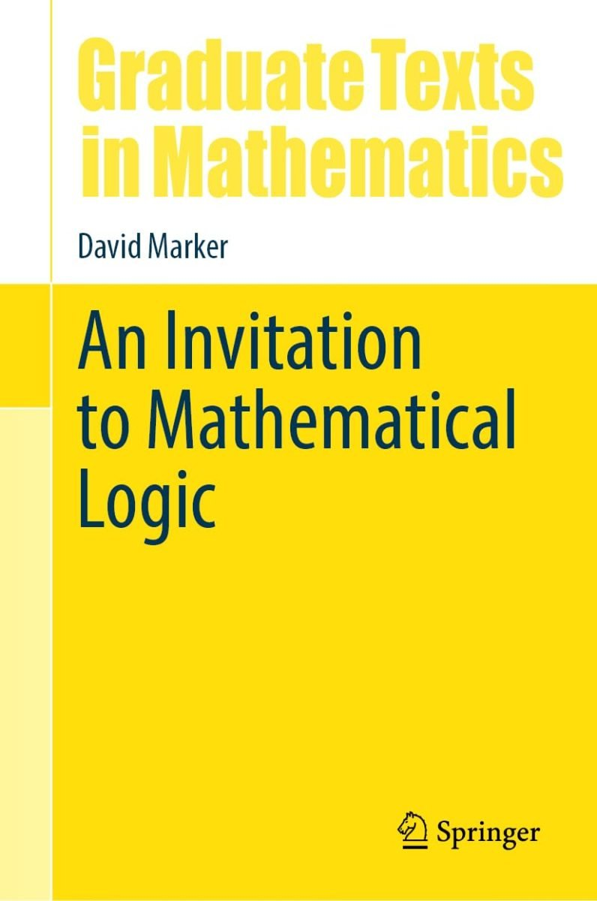

 

David Marker, the author of what has become a modern classic on model theory, has now published *An Invitation to Mathematical Logic *(Springer, 2024). “My goal was to write a text for a one-semester graduate-level introduction to mathematical logic, one that I would have liked to learn from when I was a student, and one I would like to teach from as a professor.” Part I of the book, ‘Truth and Proof’ is on first-order logic and theories and the structures for interpreting them. Part II is on ‘Elements on Model Theory’. Part III is on ‘Computability’ and Part IV discusses ‘Arithmetic and Incompleteness’. (The book doesn’t discuss set theory.)

---

In just a little more detail, Part I (64 pp.) has four chapters. Ch. 1, ‘Languages, Structures, and Theories’ provides a brisk introduction, but one which is really rather short on motivations and explanations.

A quite trivial but characteristic example: we are flatly told that $\varphi \to \psi$ is an abbreviation of $\neg\varphi \lor \psi$, take it or leave it, end of story: so much for calming the common student discomfort — graduate student or otherwise — with the conventional treatment of the conditional! Again a standard Tarksi-style semantics for the quantifiers is bluntly stated, without comment, take it or leave it: fine if you’ve met the idea before, but the student quite new to this might reasonably ask for just a bit more by way of explication.

We get the same briskness in Ch. 2, ‘Embeddings and Substructures’. Then the short Ch. 3 introduces one proof system for FOL, a sequent calculus, in which proofs are simple linear arrays, Hilbert-style. A perfectly serviceable system, but there’s no hint at all about different ways of doing things. 

Ch. 4 proves completeness, in places a bit laboriously. Marker does bring out nicely why the story goes a bit differently for countable languages and uncountable languages (needing Zorn’s Lemma or an equivalent in the second case). But on the other hand — the student reader might again reasonably ask — given that all the earlier examples of FOL languages involve small finite non-logical vocabularies, exactly why might we *care* about the uncountable case? I don’t think we are told.

These chapters are of course all done perfectly respectably, and there are nice episodes: but just how *inviting* are they to the reader quite new to the area? I, for one, didn’t find them particularly so, and I at least had the advantage of already knowing what was supposed to be going on. Marker tends to really short-change the beginner when it comes to those useful orientating sentences or two which can be so helpful (the classroom asides, the “look at it this way” guides). And relatedly, some of his proofs can leave the reader to distinguish the interesting moves from the bits where we are just joining-up-the-dots.

---

Part II (71 pp.) again has four chapters. Ch. 5 is on compactness (introduced as a simple consequence of completeness), starting with some elementary applications but soon turning to examples you’ll need more mathematical background to understand. Ch. 6 is a somewhat dense introduction to ultraproducts, giving us another proof of compactness. Ch. 7 begins on the basic idea of quantifier elimination; but soon, in Ch. 8, we are into fairly hardcore algebraic applications — fine for the graduate pure mathematicians with some serious algebra under their belt who are perhaps Marker’s core intended audience, but again not done invitingly enough (say I) to draw in other readers whose prime interests are more logical.

I hasten to add this is not a *bad* book, and Parts I and II could indeed make useful parallel/additional reading to the Study Guide’s prime recommendations on the topics of these two Parts, useful for someone who likes Marker’s style and who wants to work beyond a first introduction. But not, to my mind, the place to start.

---

Part III of Marker’s book gives us a 63 pp. introduction to the theory of computability. Ch. 9 explores models of computation, first very briskly introducing unlimited register machines. We next meet primitive recursive functions, and then the partial recursive functions. It is then proved that the partial recursive functions are exactly those partial functions computable by a register machine; and we get a bit more evidence for Church’s Thesis by noting that machines with random access memory won’t compute more. The chapter — under 20 pages before the Exercises start — ends with a very quick glance at Turing machines.

So this all proceeds at a breathless pace. There are just three sides on URM machines, just two on Turing machines. The reader is left to work out the motivation for the official definition of a primitive recursive function from the examples that actually follow that definition. Again, the move from primitive recursive to partial recursive functions is done at pace (and after just a page, we immediately meet an Ackermann-style function as an example of an intuitively computable and total recursive but not primitive recursive function). None of the ideas thus far are *hard*, of course: but there are some quite excellent, rather less breathless and hence more illuminating, alternative treatments available.

Similar remarks apply to the next two chapters (so this going to be a repetitive theme!). Ch. 10 is on universal machines and undecidability. It is shown that there is a universal computable functions $\Psi\colon \mathbb{N}^2 \to \mathbb{N}$ such that if $\varphi_n(x)$ is $\Psi(n, x)$, then $\varphi_0, \varphi_1, \varphi_2, \ldots$ is an enumeration of all the computable (one-place) partial functions. We meet Kleene’s T-predicate, the s–m–n theorem, then the unsolvability of the halting problem leading to the undecidability of first-order validity. And next it is on to Rice’s theorem and the (second) Recursion Theorem — *with all this in the space of just 11 pages*! Really?

Then Ch. 11, only a couple of pages longer, discusses computably enumerable sets, many-one reducibility, computably inseparable sets, the arithmetical hierarchy, Kolmogorov randomness and more. To be frank, I see nothing to be gained by rushing through at this pace. However mathematically ept the beginner, they will assuredly get a better conceptual understanding of what is going on — especially if engaged in solo self-study — by tackling, e.g., the more expansive early chapters of Cutland’s classic text instead of these three rushed chapters by Marker.

Now, Chs 9 to 11 may fly by at unhelpful speed, but the topics covered there are, we can readily agree,  entry-level. By contrast, Ch. 12 on Turing Reducibility rachets up the level of sophistication significantly — it is still only 14 pages, yet we get as far as Friedburg-Muchnik (which e.g. Cutland says is beyond the scope of his book, but which is proved by Cooper in his more advanced text but not starting until his p. 238) and the Low Basis Theorem (Cooper p. 330). Now, assuming you come primed with a strong enough understanding of basic computability theory, you could perhaps usefully tackle this chapter (these upper-level topics are of course intrinsically interesting).  But again my sense is that the slower presentation of Friedburg-Muchnik in Cooper (say) is significantly more likely to engender a deeper understanding of the priority method used in the proof.

So, a summary verdict on Part III: too much is done too quickly for a first encounter with this material (there are other treatments, including ones still primarily aimed at graduate mathematicians, which will be more inviting). Of course, Part III could be useful revision/consolidation material for enthusiasts who like Marker’s brusque style; though, by my lights, there are more attractive alternatives for that too.

---

Part IV of Marker’s book, ‘Arithmetic and Incompleteness’ is the longest, at over 100 pages, but I’ll be briefer.

The first chapter, Ch. 13 on the incompleteness theorems, is reasonably accessible, though for various reasons it wouldn’t be my recommendation for a place to start on the topic; still, this could well provide useful follow-up reading for beginners.

Ch. 14 is on Hilbert’s 10th problem. We don’t get quite a full proof of the MRDP theorem, with all the dots joined up; but this is pretty clearly done, I think, and so (without too many tears) you’ll get a decent sense of what is going on. However, the nice book in the AMS Student Mathematical Library by Murty and Fodden is still clearer, more inviting, and indeed more complete: I’d probably recommend reading the appropriate sections of that instead.

Ch. 15 is titled ‘Peano Arithmetic and $\epsilon_0$’. This long chapter aims at a proof of the Kirby-Paris theorem that Goodstein’s Theorem is unprovable in PA. As Marker himself clearly acknowledges with thanks, the line of argument follows closely an unpublished piece by Henry Towsner. I think you’ll want to read Marker’s chapter and Towsner’s piece in tandem — Marker is clearer, e.g., about the Hardy hierarchy of fast-growing functions, Towsner is perhaps clearer about what’s going on with the Schütte-style infinitary deduction system for arithmetic on which the overall proof turns. This two-pronged approach should then work well, and I think this is the chapter of Marker’s book that I found the most helpful addition to the literature.

The shorter final Ch. 16 is titled ‘Models of Arithmetic and Independence Results’. After a section on provably total functions of PA, the chapter dashes on to establish the unprovability in PA of the Paris-Harrington Principle in Ramsey Theory. So there is some speedy setting-up of context, and then a dense proof. Then the discussion rushes on to a number of other results in the model theory of PA (Gaifman’s Splitting Theorem, Bounded Recursive Saturation, Tennenbaum’s Theorem). We are back, then, to topics tackled at great pace. Almost anyone who wants to understand this material will be much better off working through Kaye’s approachable — indeed, one might say, particularly inviting — book *Models of Peano Arithmetic*.

---

Summary verdict? Overall I’m disappointed. Marker’s book has its moments, but it  too often provides a bumpy, breathlessly fast,  ride — so it is not so much the promised inviting introduction as a book that can be mined for supplementary/more advanced reading on some of its topics.
