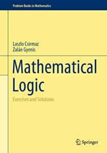

 In a  recent addition to the Springer series ‘Problem Books in Mathematics. Laszlo Csirmaz and Zalán Gyenis have put together a fairly challenging collection *Mathematical Logic: Exercises and Solutions*. From the Preface:** Problems in this volume have been collected over more than 30 years of teaching undergraduate students Mathematical Logic at Eötvös Loránd University, Budapest. The problems come in great variety: routine applications of a newly introduced technique, checking whether the conditions of a particular theorem are really necessary, extending or finding the limitations of various methods, to amusing puzzles and interesting applications of established results. They range from easy questions and riddles to proving hard theorems when all the necessary ingredients are—hopefully—available.

After preliminary chapters on sets, strategies in games, and formal languages, the main chapters are on recursion theory, propositional calculus, first-order logic, some model theory (Ehrenfeucht–Fraïssé games, quantifier elimination, ultraproducts), and formal arithmetic.

The problems are set within the context of reminders of key definitions and theorems, with the occasional hints for solutions: these take 128 pages. Then there about 200 pages of solutions. That page ratio will tell you that the solutions are typically not going to be fully-worked-through answers developed in the sort of detail that (e.g.) a student might be expected to turn in, but rather they are headline indications of the main ideas needed to get a solution (occasionally calling too on background mathematical knowledge). So this is a book, I’d say, better suited for a mathematically moderately strong reader, whether someone taking a taught course or someone self-studying an area of logic.

Of course, a book like this is going to reflect the idiosyncrasies and special interests of the authors (so for example, the propositional/predicate logic topics are almost entirely semantically driven — proof theory doesn’t get much of a look in). But such idiosyncrasies are no bad thing at all — it’s always illuminating to be coming at perhaps familiar topics from different angles. Dipping through this book, I have found it very interestingly put together, with some of the exercises requiring real thought; all but the most expert are surely going to learn from sampling it. So your university library should certainly get a copy.

Of course, there is no point in banging on about the absurdity of Springer publishing such a student-oriented book as a hardback/e-book way out of their price range. Maybe an eventual paperback is planned. (But in the meantime, you needn’t feel too sorry for the impoverished seeker after knowledge, as I’m sure that a PDF will have already found its way to the usual repositories — an eventuality which respectable readers of this blog must of course entirely deplore.)
