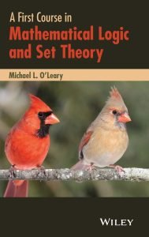

 

Michael O’Leary’s *A First Course in Mathematical Logic and Set Theory* (Wiley 2016, pp. 443) starts with two long chapters on propositional and predicate logic (pp. 116). There follow chapters on informal set theory, relations and functions (pp. 108), and then axiomatic set theory, ordinals and cardinals (again pp. 108). Then there is a final chapter ‘Models’ bringing things together, and e.g. proving the completeness of FOL (pp. 94).

The opening words of the book:** Let us define mathematics as the study of number and space. Although representations can be found in the physical world, the subject of mathematics is not physical. Instead, mathematical objects are abstract, such as equations in algebra or points and lines in geometry. They are found only as ideas in minds.

So set theory, the topic of much of the book, being neither about number nor space, isn’t mathematics? Abstract objects are ideas in minds? Well, that settles their ontological status then!

The penultimate theorem in the book:** If the Peano axioms are provable from a consistent theory, the theory is incomplete.

Really? Let’s check the definition of ‘theory’: p. 395 tells us that a theory is a set of sentences (there’s nothing here or elsewhere about effective axiomatizability, say). True Arithmetic is a theory in that wide sense, is consistent, contains the Peano axioms and is trivially complete.

So the book starts with careless waffle and ends with a careless mistake. Which isn’t too encouraging. How do things go in between?

---

This is evidently intended very much as an entry-level text. The treatment of logic in the first two chapters is certainly no more demanding than my ‘baby logic’ text *Intro to Formal Logic*. It can’t be recommended. For a start, the deductive system suggested for propositional logic is just an inelegant mess. The system for predicate logic involves a version of ‘existential instantiation’ to be deprecated (say I!). There is no real discussion in these early chapters about the semantics of FOL. Best avoided! To be honest, there’s very little sense here of an author with a feel for logic, and this won’t engender any enthusiasm in the reader.

Things do take a turn for the better with chapters 3 and 4, on the elements of informal set theory. These chapters — on a relatively quick survey — look as though they could well make a nicely accessible introduction, especially for a mathematically rather weak reader.

However, the following two chapters on axiomatic set theory just don’t work well, being too short on motivations and clear explanations. Try, for one example, the section on cofinality and large cardinals. And there are some odd issues of organization too, with the idea of the cumulative hierarchy only appearing late in the final chapter. That last chapter — also talking about FOL semantics, structures, a few model-theoretic ideas, and at last the completeness theorem — is again not done well enough to be recommendable either.

Not overall a book to put on your reading list!
