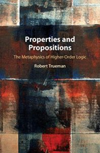

Having said that I needed to focus, I’ve immediately found myself distracted by reading Robert Trueman’s new book *Properties and Propositions*, just published by CUP.

I’ve three excuses. First, I’ve always been gripped by Frege’s claim that the concept *horse* is not a concept (I encountered this the very first year I was doing philosophy as a student, and vividly remember all those years ago a heated argument with a friend in a corridor of the UL, trying to persuade them that there really was a genuine issue here!).  And it is central to Rob’s project to extract what he sees as the truth underlying Frege’s seemingly paradoxical formulation.  Second, it’s not *that* much of a distraction to be looking at this book; its subtitle is ‘The Metaphysics of Higher Order Logic’ and the next bit I want to update in the Study Guide is the section on second-order logic. So I’ve just been thinking around and about related matters. Third and not least, I know Rob from the days just before retirement, when he was a lively and engaging presence among the logic-minded Cambridge grad students. So it is very good to see that ideas which he was starting working on then have come to fruition.

The headline news is Rob defends a view he calls Fregean realism (though, as he frankly acknowledges, it could almost equally well be called Fregean nominalism). This is a theory about properties, driven by what he takes to be Frege’s insight that properties (‘concepts’ in Frege’s unusual usage) are not objects. Rob presses the Fregean line in a strong form, arguing that is *nonsense* to say that a property is an object. “Properties and objects are … incomparable: we have a way of saying things about objects, and a way of saying things about properties, but these two ways cannot be mixed and matched.” So what are properties? On Rob’s view,  properties are nothing but the satisfaction conditions of predicates. Stress the ‘are’ and the view has a sort-of-realist flavour, stress the ‘nothing but’ (though those are my words) and the view has a sort-of-nominalist flavour. Though even talk of satisfaction conditions can be misleading: “Fregean realists must … acknowledge that, strictly speaking, it is misleading to call the referents of predicates ‘properties’, or ‘satisfaction conditions’, and come up with something better” (which indeed Rob aims to do). We are, in Tractarian style, crashing up against the limits of what can be said.

There’s a co-ordinating theory of propositions too: if properties are (if we are allowed to speak this way) satisfaction conditions, propositions are truth conditions, which Rob also identifies with states of affairs. I said things are getting Tractarian! And he ends up with an  identity theory of truth, the theory that true propositions are identical to obtaining states of affairs.

I was going to say ‘this is heady stuff’ — but that would be the wrong word, as it is very deflationary in spirit: we are certainly in a different ballpark from those recent metaphysicians who have made play with a substantial metaphysics of properties.  And I’m sympathetic to this sort of deflationary project.  Anyway, if wrestling with ideas which have their roots in Frege, the Tractatus, and Ramsey is your thing, then Rob’s invigorating book is to be warmly recommended. It’s a challenging read in the good sense of that it might disturb some received ideas (though perhaps not so much if you have thought carefully about your Dummett on Frege). But it is not challenging in the bad sense of being hard going: it is tightly focused, written in shortish chapters with model clarity. Indeed, I found that it zips along, and read most of the book in an enjoyable day. And I’ll want to return to work through parts of it more carefully.

I’ll not say more now. Except take as read my grumble about the absurd prices that CUP are now charging for print-on-demand hardback books like this one. But all the same, you should make sure your library gets a copy (or gets the online version via the Cambridge Core system).
