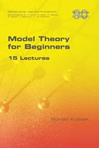

Following on from his *Mathematical Logic *(2018), Roman Kossak has now published *Model Theory for Beginners: 15 Lectures* (College Publications, 2021). As the title indicates, the fifteen chapters of this short book — just 138 pages — have their origin in introductory lectures given to graduate students in CUNY. Roughly speaking, the topics of the first half of this new book overlap quite closely with the second half of his previous book. And after grumbling a bit about Part I of that earlier book, I did warm considerably to the model-theoretic Part II, which I think makes for a very approachable elementary introduction to a cluster of issues about definability.

The new treatment is aimed at a rather more sophisticated reader, the writing is a bit less relaxed, and indeed becomes increasingly terse as the book progresses (in later chapters, I could often have done with a sentence or two more motivational chat). But overall, this strikes me as a welcome book. Though I’m at all not sure it is *all* suitable for beginners.

In a little more detail, after initial chapters on structures and (first-order) languages, Chapters 3 and 4 are on definability and on simple results such as that ordering is not definable in (Z, +). Chapter 5 introduces the notion of types, and e.g. gives Cantor’s back-and-forth proof that countable dense linearly ordered sets without endpoints are isomorphic to (Q, <). Chapter 6 defines elementary equivalence and elementary extension, and establishes the Tarski-Vaught test. Then Chapter 7 proves the compactness theorem, Henkin-style, with Chapter 8 using compactness to establish some results about non-standard models of arithmetic and set theory.

So there is a somewhat different arrangement of initial topics here, compared with books whose first steps in model theory are applications of  compactness. But the early chapters are indeed nicely done. However, I don’t think that Kossak’s Chapter 8 will be found an outstandingly clear and helpful first introduction to applications of compactness — it will probably be best read after e.g. Goldrei’s nice final chapter in his logic text.

Chapter 9 is on categoricity — in particular,  countable categoricity. (Very sensibly, Kossak wants to keep his use of set theory in this book to a minimum; but he does have a section here looking at κ-categoricity for larger cardinals κ.) And now the book starts requiring rather more of its reader. Chapter 10 is on indiscernibility and the Ehrenfeucht-Mostowski Theorem: but it is difficult to get a sense from this chapter of quite why this matters.

Up to this point, the structures we’ve been looking at are all officially relational. Chapter 11 adds functions, and discusses Skolem functions and Skolemization (this could have been more relaxed and helpful). We return to arithmetic in Chapter 12; there’s a compressed  discussion leading up to a version of Robinson’s model-theoretic proof of Tarski’s theorem of the arithmetic undefinability of arithmetic truth. But I rather doubt that this will be readily accessible to someone who hasn’t already read e.g. some of Kaye’s book on non-standard models of PA and met ideas like overspill.

The last three chapters are more advanced still, on saturation, automorphisms of recursively saturated structures, and (very briefly) stability. Are these *topics* for those just starting out on model theory? That’s a judgement call. But I suspect that the mode of *presentation* could be found quite challenging by many beginners — for me, more classroom asides in later chapters would have been welcome.

So as with Kossak’s earlier *Mathematical Logic*, then, I have rather different reactions to the two halves of *Beginning Model Theory*. But I’d say that the first eight or nine chapters *do* work very well under the advertised title (and I’ll be recommending them in the Study Guide). Later chapters are probably to be read in parallel with familiar moderately advanced texts like Marker’s classic.

Finally, bonus points for publishing very inexpensively with College Publications, and with tidy LaTeX layout too (however, they still can’t design a nice title page and verso!). But dock half a point for the number of minor typos …
