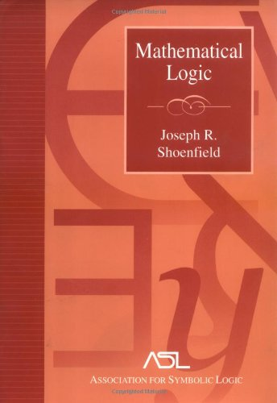

 

Joseph R. Shoenfield’s *Mathematical Logic* (Addison-Wesley, 1967: pp. 334) is officially intended as ‘a text for a first-year [maths] graduate course’. It has, over the years, been much recommended and much used (a lot of older logicians first learnt their serious logic from it). This book, however, is hard going – a significant couple of steps up in level from Mendelson (to take another older book) – though the added difficulty in mode of presentation seems to me not always to be necessary. I recall it as being daunting when I first encountered it as a student. Looking back at the book after a very long time, and with the benefit of greater knowledge, I have to say I am not any more enticed: it is *still* a tough read.

So this book can, I think, only be recommended to hard-core mathmos who already know a fair amount and can cherry-pick their way through the book. It does have heaps of hard exercises, and some interesting technical results are in fact buried there. But whatever the virtues of the book, they don’t include approachability or elegance or particular student-friendliness.

---

*Some details *Chs. 1–4 cover first order logic, including the completeness theorem. It has to be said that the logical system chosen is rebarbative. The primitives are ¬,  ∨ , ∃, and  = . Leaving aside the identity axioms, the axioms are the instances of excluded middle, instances of *φ*(*τ*) → ∃*ξ**φ*(*ξ*), and then there are five rules of inference. So this neither has the cleanness of a Hilbert system nor the naturalness of a natural deduction system. As far as I noticed, nothing is said to motivate this seemingly horrible choice as against others.

Ch. 5 is a brisk introduction to some model theory getting as far as the Ryll-Nardjewski theorem. I believe that the algebraic criteria for a first-order theory to admit elimination of quantifiers given here are original to Shoenfield. But this is surely all done very rapidly (unless you are using it as a terse revision course from quite an advanced base).

Chs. 6–8 cover the theory of recursive functions and formal arithmetic. The take-it-or-leave-it style of presentation continues. Shoenfield defines the recursive functions as those got from an initial class by composition and regular minimization: again, no real motivation for the choice of definition is given (and e.g. the definition of the primitive recursive functions is relegated to the exercises). Unusually for a treatment at this sort of level, the discussion of recursion theory in Ch. 8 goes far enough to cover a Gödelian ‘Dialectica’-style proof of the consistency of arithmetic, though the presentation once more wins no prizes for accessibility.

Ch. 9 on set theory is perhaps the book’s real original *raison d’être*; in fact, it is a quarter of the whole text. The discussion starts by briskly motivating the ZF axioms by appeal to the conception of the set universe as built in stages (an approach that has become very common but at the time of publication was I think much less usually articulated); but this isn’t the place to look for an in depth development of that idea. For a start, there is Shoenfield’s own article ‘The axioms of set theory’, *Handbook of mathematical logic*, ed. J. Barwise, (North-Holland, 1977) pp. 321–344.

We then get a brusque development of the elements of set theory inside ZF (and then ZFC), and something about the constructible universe. Then there is the first extended textbook presentation of Cohen’s 1963 independence results via forcing, published just four years previous to the publication of this book: set theory enthusiasts might want to look at this to help round out their understanding of the forcing idea. The discussion also touches on large cardinals. This last chapter wasa highly admirable achievement in its time: but it is equally surely not *now* the best place to start with set theory in general or forcing in particular, given the availability of later presentations.

---

*Summary verdict *This is pretty tough going. Now surely only for *very* selective dipping into by already-well-informed enthusiasts.
