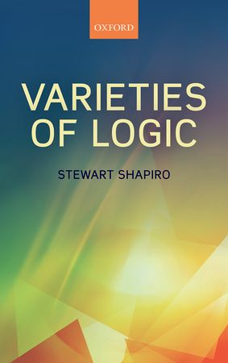

 

Stewart Shapiro’s very readable short book *Varieties of Logic *(OUP, 2014) exhibits the author’s characteristic virtues of great clarity and a lot of learning carried lightly. I found it, though, to be uncharacteristically disappointing.

Perhaps that’s because for me, in some key respects, he was preaching to the converted. For a start, I learnt long ago from Timothy Smiley that the notion of consequence  embraces a cluster of ideas. As Smiley puts it, the notion “comes with a history attached to it, and those who blithely appeal to an ‘intuitive’ or ‘pre-theoretic’ idea of consequence are likely to have got hold of just one strand in a string of diverse theories.” Debates, then, about which is the One True Notion of consequence are likely to be quite misplaced: for different purposes, in different contexts, we’ll want to emphasize and develop different strands, leading to different research programmes. As Shapiro puts it, the notion(s) of consequence can be sharpened in different ways — and taking that point seriously, he suggests, is already potentially enough to deflate some of the grand debates in the literature (e.g. about whether second-order logic is really logic).

And I’m still Quinean enough to find another of Shapiro’s themes congenial. Do we say, for example, that ‘or’ or ‘not’ mean the same for the intuitionist and the classical mathematician? Or is there a meaning-shift between the two? Shapiro argues that for certain purposes, in certain contexts, with certain interests in play, yes, we can say (if we like) that there is meaning shift; given other purposes/contexts/interests we won’t  say that. The notion of meaning is maybe too useful to do without in all kinds of situations; but it is also itself too shifting, too contextually pliable, to ground any grand debate here.

Put it this way, then. I’m pretty sympathetic with Shapiro’s claims that some large-scale grand debates are actually not very interesting because not well-posed. What that means, I take it, is that we’ll in fact find the interesting stuff going on a level or two down, below the topmost heights of cloudy generality, in areas where enough pre-processing has gone on to sharpen up ideas so that questions *can* be well-posed.

Here’s the sort of thing I mean. Take the very interesting debate between those like Prawitz, Dummett and Tennant who see a certain conception of inference and the logical enterprise as grounding only intuitionistic logic (leaving excluded middle as a non-logical extra, whose application to a domain is to be justified, if at all, on metaphysical grounds), and those like Smiley and Rumfitt who argue that that line of thought depends on failing to treat assertion and rejection on a par as we ought to do. *This* debate is prosecuted between parties who have agreed (at least for present purposes) on how to sharpen up certain ideas about logic, consequence, the role of connectives, etc.,  but still have an argument about how the research programme should proceed.

Shapiro doesn’t mention that particular debate. Absolutely fair enough (I just plucked out something that happens to interest *me*!). The complaint, though, is that he doesn’t supply us with much by way of *other* illustrations of investigations of varieties of logic at a level or two below the most arm-waving grand debates — i.e. at the levels where, by his own account, the real action must be taking place. Hence, I suppose, my general disappointment.

Shapiro does however mention a number of times one interesting example to provide grist to our mills, namely smooth infinitesimal analysis. This, if you don’t know it, is a deviant form of infinitesimal analysis — deviant, at any rate, from the mathematical mainstream. (If you look at Nader Vakil’s recent heavy volume *Real Analysis Through Modern Infinitesimals * in the CUP series Encyclopedia of Mathematics and Its Applications, then you’ll find smooth analysis gets the most cursory of mentions in one footnote.) The key idea is that there are nil-potent infinitesimals — at a rough, motivational level, quantities so small their square is indeed zero, even though they are not assumed to be zero. More carefully, we have quantities $\delta$ such that $\delta^2 = 0$ and $\neg\neg(\delta = 0)$, but — because the logic is intuitionistic — we can’t assert $\delta = 0$. And then, the key assumption, it is required that for any function $f$, and number $x$, there is a unique number $f'(x)$ such for any nil-potent $\delta$, $f(x + \delta) = f(x) + f'(x)\delta$. So looked at down at the infinitesimal level, $f$ is linear, and $f'(x)$ gives its slope at $x$ — so is the derivative of $f$. Now it turns out that, with enough assumptions in place, this theory allows us to define integration in a correspondingly natural way, and then we can readily prove the usual basic theorems of analysis.

Now that is indeed interesting. But — and here’s the rub — the internal intuitionistic logic is absolutely crucial. The usual complaint by the intuitionist is that adding the law of excluded middle unjustifiably collapses important distinctions (in particular the distinction between $\neg\neg P$ and $P$).  But in the case of smooth analysis, add the law of excluded middle and the theory doesn’t just collapse (by making all the nil-potent infinitesimals identically zero) but becomes inconsistent. What are we to make of this? In particular, what can the defender of classical logic make of this?

I guess there is quite a lot to be said here. It is a nice question, for example, how much sense we can make of all this outside the topos-theoretic context where the Kock-Lawvere theory of smooth analysis had its original home. To be sure, as in John Bell’s *A Primer of Infinitesimal Analysis*, we can write down various axioms and principles and grind through deductions: but how much understanding ‘from the inside’ does that engender? Shapiro says just enough to pique a reader’s interest (for someone who hasn’t already come across smooth analysis), but not enough to leave them feeling they have much grip on what is going on, or to help out those who are already puzzling about the theory. And that’s a real disappointment.
