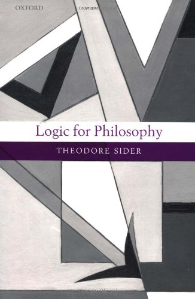

 

What do I think about Ted Sider’s *Logic for Philosophy *(OUP 2010)? Isn’t it a rather obvious candidate for being recommended in the Guide?

The book divides almost exactly into two halves. The first half (some 132 pages), after an initial chapter ‘What is logic?’, reviews classical propositional and predicate logic and some variants. The second half (just a couple of pages longer) is all about modal logics.

I have to say that the first half of Sider’s book really seems to me to be ill-judged (showing neither the serious philosophical engagement you might hope for, or much mathematical appreciation).

Here is one preliminary point. The intended audience for this book is advanced *philosophy* students, so presumably students who have read — or at least *will* read — their Frege and their *Tractatus*. So what, for example, will they make of being baldly told in §1.8, without defence or explanation, that relations are in fact objects (sets of ordered pairs), and that functions are objects too (more sets of ordered pairs)? There’s nothing here about intension and extension, and nothing about why we should identify functions with their graphs. We are equally baldly told to think of binary functions  as one-place functions on ordered pairs (and the function that maps two things to their ordered pair is what, exactly …?). Puzzled philosophers might well want to square what they have learnt from Frege and the Wittgenstein with modern logical practice as they first encountered  it in their introductory logic courses: so you’d expect a second level book designed for such students to proceed more cautiously and address the obvious worries. But that doesn’t happen here.

And in fact we get a pretty skewed description of modern logic anyway, even from the very beginning, starting with the *P*s and *Q*s. Sider seems stuck with thinking of the *P*s and *Q*s as Mendelson does (the one book which he says in the introduction that he is drawing on for the treatment of propositional and predicate logic). But Mendelson’s Quinean approach is actually very unusual among logicians, and certainly doesn’t represent the shared common view of ‘modern logic’. I won’t rehearse the case again now, as I’ve explained it at length here. But students need to know there isn’t a uniform single line to be taken here.

When Sider turns to looking at formal systems for propositional logic we get sequent proofs in what is pretty much the style of Lemmon’s book. Which as anyone who spent their long-distant youth teaching a Lemmon-based course knows, students do *not* find user friendly. Why do things this way? And how are we to construe such a system? One natural way of understanding what is going on is that the system is a formalized meta-theory about what follows from what in a formal object-language. But according to Sider sequent proofs aren’t metalogic proofs *because* they are proofs in a formal system. Because? Has Sider not noticed that in his favoured Mendelson the formal proofs are all metalogical?

OK, so the philosophical student is introduced to an unfriendly version of a sequent calculus for propositional logic, and then meets an even more unfriendly Hilbertian axiomatic system. Good things to know about, but probably not when done like this. And not — in a book addressed to puzzled philosophers — without a lot more discussion of how this all hangs together with what the student is likely to already know about, natural deduction and/or a tableau system. And not without a better discussion, too, of the way the conception of logic changed between e.g. *Principia* and Gentzen, from being seen as regimenting a body of special *truths* to being seen as regimenting inferential practice. Further, the decisions about what to cover and what not to cover are pretty inexplicable. For example, why pages actually proving the deduction theorem for axiomatic propositional logic, and later just one paragraph on the compactness theorem for FOL, which students might really need to know about and understand some applications of?

Predicate logic is then dealt with by an axiomatic system (apparently because this approach will come in handy in the second half of the book — I suspect indeed that the real raison d’être of the book is indeed the discussion of modal logic). I can’t think this is the best way to equip philosophers who have a perhaps shaky grip on formal ideas with a better understanding of first-order logic. The explanation of the semantics of a first-order language isn’t bad, but not especially good either. This certainly isn’t the go-to treatment for giving philosophers what they need.

True, a nice feature of this half of Sider’s book is that it does have a discussion of some non-classical propositional logics, and has a little about descriptions and free logic.  But then the philosophically serious issues of intuitionistic logic and second-order logic are dealt with far too quickly to be useful, so the breadth of Sider’s coverage goes with irritating superficiality.

I could go on. But the headline summary about the *first* part of Sider’s book is that I found it (whether wearing my mathematician’s or philosopher’s hat) irritating and unsatisfactory. Sorry to be carping!

Suppose, however, that you have some background in classical first-order logic, and want to learn something about modal logic (including quantified modal logic) and, relatedly, about Kripke semantics for intuitionistic logic. Then the second half of Sider’s *Logic for Philosophy* certainly aims to cover the ground, and it will tell you about formal theories of counterfactuals too. How well does it succeed, especially if you skip the first half of the book and dive straight in, starting with Ch. 6?

These later chapters in fact seem to me to work fairly well (assuming a logic-competent reader). Compared with the early chapters with their inconsistent levels of coverage and sophistication, the discussion here develops more systematically and at a reasonably steady level of exposition. There is a lot of (acknowledged) straight borrowing from Hughes and Cresswell, and serious student readers would probably do best by supplementing Sider with a parallel reading of that approachable classic text. But if you want a pretty clear explanation of Kripke semantics together with an axiomatic presentation of some standard modal propositional systems, and want to learn e.g. how to search systematically for countermodels, Sider’s treatment could well work as a basis. And then the later treatments of quantified modal logic (and some of the conceptual issues they raise) are also pretty lucid and tolerably approachable.

This is a game of two halves then. Before the interval, *Logic for Philosophy* is pretty scrappy and I wouldn’t recommend it at all. After the interval, when Sider plays through some standard modal logics, things look up. I wouldn’t have him at the top of the league for modality-for-philosophers (see the current version of the Guide for preferred recommendations); but Sider’s mini-book-within-a-book turns in a respectable performance.
