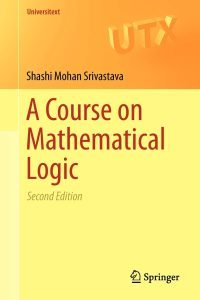

 

The first edition of Shashi Mohan Srivastava’s *A Course on Mathematical Logic* (Springer, 2008) is notable for its brevity — propositional and first-order logic, just a little about model theory, then recursive functions and Gödelian incompleteness, all treated in just 134 pages (before the references and index). The second edition (Springer, 2013) adds some fifty pages, almost all of them in a newly inserted chapter diving much further into model theory, at a notably more advanced level than the rest of the book, rather unbalancing it.

So I’ll begin by commenting on the original version of the book; then I’ll add some remarks about the new material.

---

*Some details about the first edition* In his Preface, Srivastava writes ‘‘Serious efforts have been made to make the book suitable for both instructional and self-reading purposes.’’ And indeed the book strikes me as mostly admirably clear; the brevity is mainly the result of a tight focus on a selection of main topics. Though a real beginner launching herself on solo study would occasionally miss the kind of classroom chat which e.g. can help to motivate key constructions.

Chapter 1 is on the syntax, Chapter 2 on the semantics of first-order languages. The semantics is kept simple by the device of taking expanded languages with a name for every object in the domain. So that we can put $\exists vA(v)$ true in the expanded language (interpreted in a given structure, with everything named) iff, for some $a$ in the domain, $A(i_a)$ is true (where $i_a$ names $a$ in the expanded language). Then a closed sentence in the original languages counts as true if true in the expanded language. Though a beginner could probably do with rather more running commentary about this approach. The chapter ends with a little about embeddings, substructres, etc. So far, so good.

Chapter 3 introduces propositional languages, with syntax, semantics, and a proof of compactness neatly done. Then there is a proof system for propositional logic, and here I have to say I don’t particularly like the chosen system. Just $\neg$ and $\lor$ are primitive; we have all instances of excluded middle as axioms; and then there are four rules of inference — from $A$ infer $B \lor A$, from $A \lor A$ infer $A$, from $A \lor (B \lor C)$ infer $(A \lor B) \lor C$, and from $(A \lor B)$ and $\neg A \lor C$ infer $B \lor C$. Of course it all \emph{works} to give a sound and complete classical logic if we add the usual definitions for the other connectives. But is it elegant? Is it natural? Does it make for nice proofs? We certainly get a a messy few pages leading up to a completeness proof.

Chapter 4 gives us a proof system for FOL (with $\neg$, $\lor$ and $\exists$ primitive). The axioms are as for propositional logic plus axioms governing identity, and all instances of $A[t/x] \to \exists xA$ under the usual conditions. The rules are as for propositional logic plus the rule that from $A \to B$ with $x$ not free in $B$ we can infer $\exists xA \to B$. Again not exactly beautiful, and the quantifier rules are probably not expansively enough explained for beginners. After some metatheorems and a general discussion of consistency and completeness, we get a proof of completeness at the beginning of Chapter 5: this is quite nicely done. But overall not a ‘best buy’ as far as treatments of this essential material on FOL is concerned.

The rest of Chapter 5 (in this first edition) gives entry-level discussions of interpreting one theory in another, of extending a theory by definitions, and then turns to the Compactness Theorem and some elementary applications. There’s a section on complete theories. And this helpful chapter finishes with a very brief discussion of some applications in algebra.

Chapter 6 turns to discuss recursive functions and arithmetization. Recursiveness is defined in terms of a generous supply of initial functions, composition and regular minimization. In other words, closure under primitive recursion has to be proved. I don’t find this a particularly attractive or natural approach (ok, it makes the proof of results the representability of recursive functions easier, but at the price of making recursiveness a less intuitively appealing notion). Chapter 7 on incompleteness makes another disputable choice — we get Gödel only in the form ‘‘Every axiomatized, consistent extension of $N$ [a certain formal arithmetic] is undecidable and so incomplete.’’ Then the discussion is followed by a perhaps rather opaque treatment of the arithmetic hierarchy. Again, not the best place to start for beginners.

---

*A note on the second edition’s added material*In the revised version, most of the old Chapter 5 gets absorbed into an expanded Chapter 4 and we have an almost entirely new Chapter 5 on ‘Model Theory’. At 56 pages long, this is by far the most substantial chapter in the book. And it seems to me that the difficulty level is ratcheted up a notch or three as well. We get as far as theorems like this: *Let $T$ be a countable, complete, $\omega$-stable theory, with $M \vDash T$ and $A \subset M$. Then the isolated types are dense in $S_n^M(A)$.* Now, this hardly counts as really entry-level model theory, does it? So what we have in this chapter is a quite rapid-fire tour through some model-theoretic ideas which might provide useful revision material for some.

---

*Summary verdict* Someone who has already met treatments of FOL and computability/incompleteness could well profit from a brisk read through the 134 pages of this first edition of this text, pausing over points of interest and thinking about the pros and cons of tackling things Srivastava’s way. The added chapter in the second edition might be of use to suitably primed readers, but I can’t recommend for beginners.
