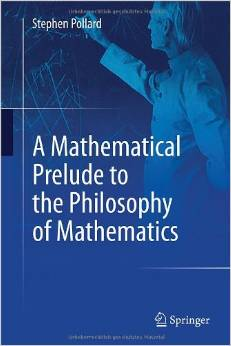

The Autonomy of Mathematical Knowledge — Chap. 1

*A number of times, I have set out to blog about a book, chapter by chapter, enticed by its prospectus. And then, at some point, lost the will to continue because the book turned out for one reason or another to be very disappointing. This is a case in point. But perhaps there is enough interest in the comments I do make, as far as they go, to link to them.*

I’m planning to blog, chapter by chapter, about Curtis Franks’s new book on Hilbert, The Autonomy of Mathematical Knowledge (all page references are to this book).

Let’s take ourselves back to the “foundational crisis” at beginning of the last century. Mathematicians have, over the preceding decades, freed themselves from the insistence that mathematics is tied to the description of nature: as Morris Kline puts it, “after about 1850, the view that mathematics can introduce and deal with arbitrary concepts and theories that do not have any immediate physical interpretation … gained acceptance” (p. 11). And Cantor could write “Mathematics is entirely free in its development and its concepts are restricted only by the necessity of being non-contradictory and coordinated to concepts … introduced by previous definition” (p. 9). Very bad news, then, if all this play with freely created concepts in fact gets us embroiled in contradiction!

As Franks notes, there are two kinds of responses that we can have to the paradoxes that threaten Cantor’s paradise.
- We can seek to “re-tether” mathematics. Could we confine ourselves again to applicable mathematics which has, as we’d anachronistically put it, a model in the natural world so must be consistent? The trouble is we’re none too clear what this would involve (remember, we are back at the beginning of the twentieth century, as relativity and quantum mechanics are getting off the ground, and any Newtonian confidence that we had about structure of the natural world is being shaken). So put that option aside. But perhaps (i) we could try to go back to find incontrovertible logical principles and definitions of mathematical notions in logical terms, and try to reconstruct mathematics on a firm logical footing. Or (ii) we could try to ensure that our mathematical constructions are grounded in mental constructions that we can perform and have a secure epistemic access to. Or (iii) we could try to diagnose a theme common to the problem paradoxical cases — e.g. impredicativity — and secure mathematics by banning such constructions. Of course, the trouble is that the logicist response (i) is problematic, not least because (remember where we are in time!) logic itself isn’t in as good a shape as most of the mathematics we are supposedly going to use it to ground, and what might count as logic is obscure. Indeed, as Peirce saw, “a mature science like mathematics, with a history of successful elucidation and problem solving, was needed in order to develop logic” (p. 20); and indeed “all formal logic is merely mathematics applied to logic” (p. 21). The intuitionistic line (ii) depends on an even more obscure notion of mental construction, and in any case — in its most worked out form — cripples mathematics. The predicativist option (iii) is perhaps better, but still implies that swathes of seemingly harmless classical mathematics will have to be abandoned. So what to do? What foundational programme will rescue us?
- Well, perhaps we shouldn’t seek to give mathematics a philosophical “foundation” at all. After all, the paradoxes arise within mathematics, and to avoid them we just … need to do mathematics better. As Peirce — for example — held, mathematics risks being radically distorted if we seek to make it answerable to some outside considerations (from philosophy or logic) rather than being developed “by the continuous confrontation with and the creative solution of ordinary mathematical problems” (p. 21). And we don’t need to look outside for a prior justification that will guarantee consistency. Rather we need to improve our mathematical practice, in particular improve the explicitness of our regimentations of mathematical arguments, to reveal where the fatal mis-steps must be occurring, and expose the problematic assumptions.

Now enter Franks’s Hilbert. We are perhaps wont to read Hilbert as belonging to Camp (1), advancing a fourth philosophical foundationalist position, to sit alongside (i) to (iii). We see his “finitism” as aiming to impose more constraints on “real” mathematics from outside mathematics. And, taking such a perspective, most mathematicians and many philosophers would agree with Tarski’s dismissal of Hilbert’s supposed philosophy as “theology”, and insist on a disconnect between the dubious philosophy and the proof-theory it inspired.

But Franks is having none of this. His Hilbert is a sort-of-naturalist like Peirce (in sort-of-Maddy’s sense of “naturalist:), and he is firmly situated in Camp (2). “His philosophical strength was not in his ability to carve out a position among others about the nature of mathematics, but in his realization that the mathematical techniques already in place suffice to answer questions about those techniques — questions that rival thinkers had assumed were the exclusive province of pure philosophy. … One must see him deliberately offering mathematical explanations where philosophical ones were wanted. He did this, not to provide philosophical foundations, but to liberate mathematics from any apparent need for them.” (p. 7).

So there, in outline — and we don’t get much more than outline in Chap. 1 — is the shape of Franks’s Hilbert. So, now let’s read on to Chap. 2 to see how well Franks makes the case for his reading. To be continued.
