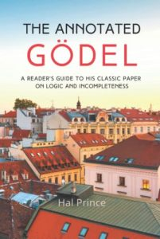

Some years ago, Charles Petzold published his *The Annotated Turing* which, as its subtitle tells us, provides a guided tour through Alan Turing’s epoch-making 1936 paper. I was prompted at the time to wonder about putting together a similar book, with an English version of Gödel’s 1931 paper interspersed with explanatory comments and asides. But I thought I foresaw too many problems. For a start, not having any German, I’d have had to use one of the existing translations, which would lead to copyright issues, and presumably extra problems if I wanted to depart from the adopted translation by e.g. rendering *Bew* by *Prov*, etc. And then I felt it wouldn’t be at all easy to find a happy level at which to pitch the commentary.

Plan (A) would be to follow Petzold, who is very expansive and wide ranging about Turing’s life and times, and is aiming for a fairly wide readership too (his book is over 370 pages long). I wasn’t much tempted to try to emulate *that*.

Plan (B) would be write for a much narrower audience, readers who are already familiar with some standard modern textbook treatment of Gödelian incompleteness and who want to find out how, by comparison, the original 1931 paper did things. You then wouldn’t need to spend time explaining e.g. the very ideas of primitive recursive functions or Gödel numberings, but could rapidly get down to note the quirks in the original paper, giving a helping hand to the logically ept so that they can navigate through. However, the Introductory Note to the paper in the *Collected Works* pretty much does that job. OK, you could say a bit more (25 pages, perhaps rather than 14). But actually the original paper is more than clear enough for that to be hardly necessary, if you have already tackled a good modern treatment and then read that Introductory Note for guidance in reading Gödel himself.

Plan (C) would take a middle course. Not ranging very widely, sticking close to Gödel’s text. But also not assuming much logical background or any prior acquaintance with the incompleteness theorems, so having to slow down to explain ideas of formal systems, primitive recursion and so on and so forth. But to be frank, I didn’t and don’t think Gödel’s original paper is the best peg on which to hang a first introduction to the incompleteness theorems. Better to write a book like *GWT*! So eventually I did just that, and dropped any thought of doing for Gödel something like Petzold’s job on Turing.

But now, someone *has* bravely taken on that project. Hal Prince, a retired software engineer, has written *The Annotated Gödel,* a sensibly-sized book of some a hundred and eighty pages, self-published on Amazon. Prince has retranslated the incompleteness paper in a somewhat more relaxed style than the version in the *Collected Works, *interleaving commentary intended for those with relatively little prior exposure to logic. So he has adopted plan (C). And the thing to say immediately — before your heart sinks, thinking of the dire quality of some amateur writings on Gödel — is that the book does look entirely respectable!

---

Actually, I shouldn’t have put it quite like that, because I do have my reservations about the typographical *look* of the book. Portions of different lengths of a translation from the 1931 paper are set in pale grey panels, separated by episodes of commentary. And Prince has taken the decidedly odd decision *not* to allow the grey textboxes containing the translation to split themselves over pages. This means that an episode of commentary can often finish halfway down the page, leaving blank inches before the translation continues in a box at the top of the next page. And there are other typographical choices while also unfortunately make for a somewhat  unprofessional look. That’s a real pity, and does give a quite misleading impression of the quality of the book.

---

Now, I haven’t read the book with a beady eye from cover to cover; but the translation of the prose seems quite acceptable to me. Sometimes Prince seems to stick a bit closer to the Gödel’s original German than the version in the Works, sometimes it is the other way about. For example, in the first paragraph of Gödel’s §2, we have** G, undefinierten Grundbegriff: W, primitive notion: P, undefined basic notion,

while in the very next sentence we have** G, Die Grundzeichen: W, The primitive signs: P, The symbols.

But such differences are relatively minor.

Where P’s translation of G departs most is not in rendering the German prose but in handling symbolism. W just repeats on the Englished pages exactly the symbolism that is in the reprint of G on the opposite page. But where G and W both e.g. have “Bew(*x*)”, P has “*isProv*(*x*)”. There’s a double change then. First, P has rendered the original “Bew”, which abbreviated “beweisbare Formel”, to match his translation for the latter, i.e. “provable formula”. Perhaps a good move. But Prince has also included an “is” (to indicate that what we have here is an expression attributing a property, not a function expression). To my mind, this makes for a bit of unnecessary clutter here and elsewhere: you don’t need to be explicitly reminded on every use that e.g. “*Prov*” expresses a property, not a function.

Elsewhere the renditions of symbolism depart further. For example, G has “$A_1\mbox{-}Ax(x)$” for the wff which says that $x$ is an instance of Axiom Schema II.1. P has “*isAxIIPt1*(*x*)”. And there’s a lot more of this sort of thing which makes for some very unwieldy symbolic expressions that I don’t find particularly readable.

There are other debatable symbolic choices too. P has “$\Rightarrow$” for the object language conditional, which is an unfortunate and unnecessary change. And P writes “$x[v \leftarrow y]$” for the result of substituting $y$ for $v$ where $v$ is free in $x$. This may be a compsci notation, but to my untutored eyes makes for mess (and I’d say bad policy too to have arrows in different directions meaning such different things).

Other choices for rendering symbolism involve more significant departures from G’s original but are also arguably happier (let’s not pause to wonder what counts as faithful enough translation!). For example, there is a moment when G has the mysterious “*p* = 17 Gen *q*”: P writes instead “*p* = *forall*($\mathbf{x_1}$, *q*)”. In G, 17 is the Gödel number for the variable $x_1$: P uses a convention of bolding a variable to give its Gödel number, which is tolerably neat.

There’s more to be said, but I think your overall verdict on the translation element of Prince’s book might go either way. The prose is as far as I can judge handled well. The symbolism is tinkered with in a way which makes it potentially clearer on the small scale, but makes for some off-putting longwindedness when rendering long formulas. If you *are* going to depart from Gödel’s symbolism, I don’t think that P chooses the best options. But as they say, you pays your money and makes your choice.

---

But what about the bulk of the book, the commentary and explanations interspersed with the translation of Gödel’s original? My first impression is definitely positive (as I said, I haven’t yet done a close reading of the whole). We do get a *lot* of helpful framing of the kind e.g. “Gödel is next going to define … It is easier to understand these definitions if we think about what he needs and where he is going.” And Prince’s discussions as we go along do strike me as consistently sensible and accurate enough, and will indeed be helpful to those who bring the right amount to the party.

I put it like that because, although I think the book is intended for those with little background in logic, I really do wonder whether e.g. the twenty pages on the proof of Gödel’s key Theorem VI will gel with those who haven’t previously encountered an exposition of the main ideas in one of the standard textbooks. This is the very difficulty I foresaw in pursuing plan (C). Most readers without much background will be better off reading a modern textbook.

But, on the other hand, for those who *have* already read *GWT* (to pick an example at random!), i.e. those who already know something of Gödelian incompleteness, they should find this a useful companion if they want to delve into the original 1931 paper. Though some of the exposition will now probably be unnecessarily laboured for them, while they would have welcomed some more  “compare and contrast” explanations bringing out more explicitly how Gödel’s original relates to standard modern presentations.

In short, then: if someone with a bit of background *does* want to study Gödel’s original paper, whereas previously I’d just say ‘read the paper together with its Introductory Note in the *Collected Works’, *I’d now add ‘and, while still doing that, and depending quite where you are coming from and where you stumble, you might very well find some or even all of the commentary in Hal Prince’s *The Annotated Gödel *a* *pretty helpful accompaniment’.
